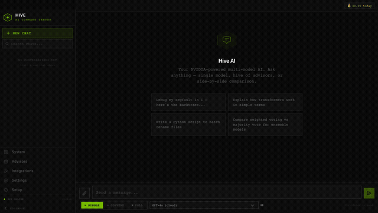
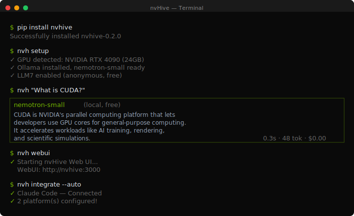
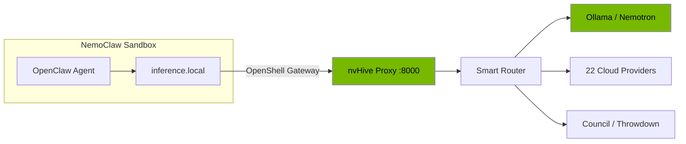
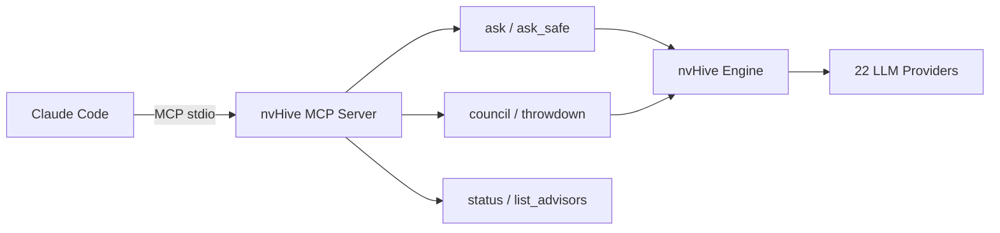
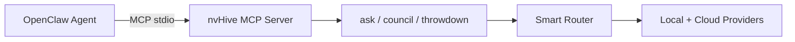
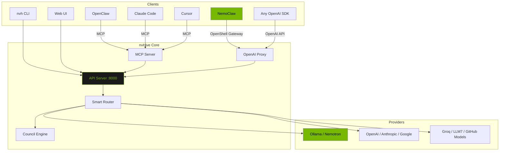

# nvHive

**One command. Every AI model. Your GPU or the cloud.**

     

- **Ask once, get the best model.** nvHive routes your question to the right LLM across 22 providers and 63 models — automatically, based on task type, cost, and privacy.
- **Run it free on your GPU.** NVIDIA Nemotron models run locally via Ollama with no API keys, no cloud costs, no data leaving your machine.
- **Council mode.** When one model isn't enough, multiple LLMs debate your question and synthesize a consensus answer.

---

### Web Dashboard

<p align="center">
  
</p>

Launch with `nvh webui` — NVIDIA-themed dark UI with real-time streaming, council visualization, provider management, and one-click integrations. [Full WebUI guide →](docs/WEBUI.md)

### CLI

<p align="center">
  
</p>

---

## Quick Start

```bash
pip install nvhive
nvh "What is machine learning?"
```

No API keys needed — works immediately with free providers. Run `nvh setup` to add more.

<details>
<summary><b>Platform-specific installers</b></summary>

**Linux (NVIDIA GPU):**
```bash
curl -fsSL https://raw.githubusercontent.com/thatcooperguy/nvHive/main/install.sh | bash
```

**macOS:**
```bash
curl -fsSL https://raw.githubusercontent.com/thatcooperguy/nvHive/main/install-mac.sh | bash
```

**Windows (PowerShell):**
```powershell
iwr -useb https://raw.githubusercontent.com/thatcooperguy/nvHive/main/install.ps1 | iex
```

Auto-detects GPU, downloads the right Nemotron model, configures everything. Supports Linux (NVIDIA CUDA), macOS (Apple Silicon Metal), and Windows.
</details>

## How It Works

1. You type: `nvh "Should I use Redis or Postgres for sessions?"`
2. The **action detector** checks if this is a system command. If so, it executes directly.
3. The **smart router** classifies the task, scores all advisors on relevance, cost, and speed.
4. **Local-first**: simple queries stay on Nemotron (free, private, no network).
5. **Cloud when needed**: complex queries route to the best cloud model.

## Core Commands

| Command | What It Does |
|---------|-------------|
| `nvh "question"` | Smart route to the best available model |
| `nvh convene "question"` | Council of AI experts debate and synthesize |
| `nvh throwdown "question"` | Two-pass deep analysis with critique |
| `nvh safe "question"` | Local only — nothing leaves your machine |
| `nvh code / write / research` | Task-optimized routing |
| `nvh setup` | Interactive provider setup wizard |
| `nvh webui` | Launch the web dashboard |
| `nvh integrate` | Auto-detect and connect all platforms |
| `nvh status` | Providers, GPU, budget at a glance |

[Full command reference →](docs/COMMANDS.md)

## Providers

**22 providers. 63 models. 25 free — no credit card required.**

Ollama (local), OpenAI, Anthropic, Google Gemini, Groq, NVIDIA NIM, DeepSeek, GitHub Models, LLM7, Mistral, Cohere, Cerebras, SambaNova, and more. The smart router picks the best one. Or go direct: `nvh groq "question"`.

[Full provider table →](docs/PROVIDERS.md)

---

## Integrations

nvHive connects to your existing AI platforms. Auto-detect everything with one command:

```bash
nvh integrate --auto
```

Or set up each platform individually:

### NVIDIA NemoClaw

nvHive works as an **inference provider** inside [NemoClaw](https://github.com/NVIDIA/NemoClaw), giving NemoClaw agents access to smart routing, council consensus, and throwdown analysis.

```bash
nvh nemoclaw --start    # start proxy
nvh nemoclaw --test     # verify connectivity
```



NemoClaw agents can request virtual models: `auto`, `safe`, `council`, `council:N`, `throwdown`. Set `x-nvhive-privacy: local-only` for sensitive queries.

[Full NemoClaw guide →](docs/NEMOCLAW.md)

### Anthropic Claude Code

Register nvHive as an MCP tool server — Claude Code gets access to multi-model routing, council consensus, and provider management:

```bash
pip install "nvhive[mcp]"
claude mcp add nvhive nvh mcp
```



MCP tools available: `ask`, `ask_safe`, `council`, `throwdown`, `status`, `list_advisors`, `list_cabinets`.

### OpenClaw

Register nvHive tools with any OpenClaw agent:

```bash
nvh openclaw --config     # generates openclaw.json
nvh openclaw --start      # start MCP server
```



### Cursor

```bash
nvh integrate --auto      # auto-detects Cursor and configures
```

Or manually add to `~/.cursor/mcp.json`:
```json
{ "mcpServers": { "nvhive": { "command": "nvhive-mcp" } } }
```

### OpenAI-Compatible Proxy

Any tool that speaks the OpenAI API can use nvHive as a backend:

```python
from openai import OpenAI
client = OpenAI(base_url="http://localhost:8000/v1/proxy", api_key="nvhive")
response = client.chat.completions.create(
    model="auto",  # nvHive picks the best model
    messages=[{"role": "user", "content": "Hello"}]
)
```

### Integration Architecture



[Detailed integration guides →](docs/NEMOCLAW.md) · [SDK & API reference →](docs/SDK_API.md)

---

## Privacy and Safe Mode

- **`nvh safe`** — local models only, nothing leaves your machine
- **Local default** — simple queries stay on Ollama, complex route to cloud
- **HIVE.md** — drop a context file in any project, all advisors see it automatically

## Python SDK

```python
from nvh import ask, convene, safe

response = await ask("What is machine learning?")
result = await convene("Should we use Rust?", cabinet="engineering")
private = await safe("Analyze my salary data")
```

Sync versions: `ask_sync`, `convene_sync`, `safe_sync`. [SDK reference →](docs/SDK_API.md)

## Learn More

| Guide | Description |
|-------|-------------|
| [Getting Started](docs/GETTING_STARTED.md) | First-time setup and usage |
| [Commands](docs/COMMANDS.md) | Full CLI reference |
| [Providers](docs/PROVIDERS.md) | 22 providers, GPU-adaptive models |
| [Council System](docs/COUNCIL.md) | Multi-LLM consensus, 12 cabinets |
| [NemoClaw](docs/NEMOCLAW.md) | NVIDIA NemoClaw integration |
| [SDK & API](docs/SDK_API.md) | Python SDK, proxy, MCP server |
| [Web Interface](docs/WEBUI.md) | Dashboard pages and design |
| [Orchestration](docs/ORCHESTRATION.md) | GPU-powered routing and eval |
| [For Students](docs/STUDENTS.md) | Homework, tutoring, exam prep |
| [Tools](docs/TOOLS.md) | 27 built-in tools |
| [Configuration](docs/CONFIGURATION.md) | Config, HIVE.md, budget |
| [Architecture](docs/ARCHITECTURE.md) | System design and data flow |

## Contributing

See [CONTRIBUTING.md](CONTRIBUTING.md) for development setup and pull request guidelines.

## License

MIT License. See [LICENSE](LICENSE) for details.
