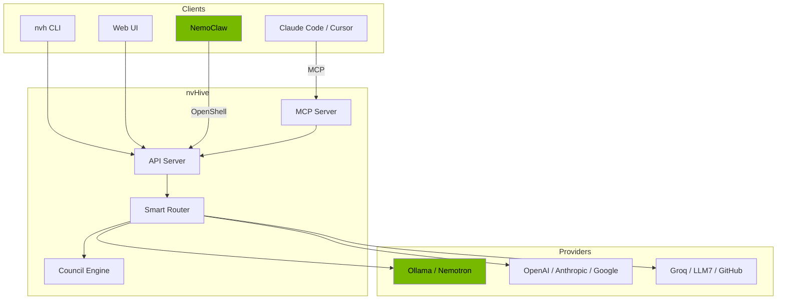

# nvHive

**One command. Every AI model. Your GPU or the cloud.**

     

<p align="center">
  
</p>

- **Ask once, get the best model.** nvHive routes your question to the right LLM across 22 providers and 63 models — automatically, based on task type, cost, and privacy.
- **Run it free on your GPU.** NVIDIA Nemotron models run locally via Ollama with no API keys, no cloud costs, no data leaving your machine.
- **Council mode.** When one model isn't enough, multiple LLMs debate your question and synthesize a consensus answer.

---

## Quick Start

```bash
pip install nvhive
nvh "What is machine learning?"
```

No API keys needed — works immediately with free providers.

<details>
<summary><b>Platform-specific installers</b></summary>

**Linux (NVIDIA GPU):**
```bash
curl -fsSL https://raw.githubusercontent.com/thatcooperguy/nvHive/main/install.sh | bash
```

**macOS:**
```bash
curl -fsSL https://raw.githubusercontent.com/thatcooperguy/nvHive/main/install-mac.sh | bash
```

**Windows (PowerShell):**
```powershell
iwr -useb https://raw.githubusercontent.com/thatcooperguy/nvHive/main/install.ps1 | iex
```

The installer auto-detects your GPU, downloads the right Nemotron model, and configures everything. Supports Linux (NVIDIA CUDA), macOS (Apple Silicon Metal), and Windows.
</details>

## Your First 60 Seconds

```
$ nvh "Explain Python decorators in 3 sentences"
╭─ nemotron-small (local, free) ──────────────────────────────────────╮
│ A decorator is a function that takes another function as input and  │
│ returns a modified version of it. You apply one with @decorator     │
│ syntax above a function definition. They're used for cross-cutting  │
│ concerns like logging, caching, and access control without          │
│ modifying the original function's code.                             │
╰─────────────────────────────────────── 0.4s · 52 tokens · $0.00 ───╯
```

Every response shows which model answered, how long it took, and what it cost.

## How It Works

1. You type: `nvh "Should I use Redis or Postgres for sessions?"`
2. The **action detector** checks if this is a system command (install, open, find). If so, it executes directly.
3. The **smart router** classifies the task, scores all advisors on relevance, cost, and speed, and picks the best one.
4. **Local-first**: simple queries stay on Nemotron via Ollama (free, private, no network).
5. **Cloud when needed**: complex queries route to the best cloud model.

## Core Commands

| Command | What It Does |
|---------|-------------|
| `nvh "question"` | Smart route to the best available model |
| `nvh convene "question"` | Council of AI experts debate and synthesize |
| `nvh throwdown "question"` | Two-pass deep analysis with critique |
| `nvh safe "question"` | Local only — nothing leaves your machine |
| `nvh quick "question"` | Fastest model, minimal latency |
| `nvh code "question"` | Code-optimized routing |
| `nvh write "question"` | Writing-optimized with style guidance |
| `nvh research "question"` | Multi-source research with citations |
| `nvh do "task"` | Detect action and execute (install, open, find) |
| `nvh setup` | Interactive provider setup wizard |
| `nvh webui` | Launch the web dashboard |
| `nvh integrate` | Auto-detect and connect NemoClaw, Claude Code, etc. |
| `nvh status` | Providers, GPU, budget at a glance |
| `nvh keys` | Free API key signup links |

<details>
<summary><b>All commands</b></summary>

See [docs/COMMANDS.md](docs/COMMANDS.md) for the full command reference including advisor management, workflows, templates, scheduling, and more.
</details>

## Providers

**22 providers. 63 models. 25 free — no credit card required.**

Includes Ollama (local), OpenAI, Anthropic, Google Gemini, Groq, NVIDIA NIM, DeepSeek, GitHub Models, LLM7, Mistral, Cohere, Cerebras, SambaNova, Fireworks, SiliconFlow, HuggingFace, and more.

The smart router picks the best one for each query. Or go direct: `nvh groq "question"`, `nvh openai "question"`.

<details>
<summary><b>Full provider table</b></summary>

See [docs/PROVIDERS.md](docs/PROVIDERS.md) for the complete provider list with free tier details and GPU-adaptive model selection.
</details>

## Web Interface

Launch the NVIDIA-themed dashboard with one command:

```bash
nvh webui
```

<p align="center">
  
</p>

8 pages: Chat, Council, Query Builder, Advisors, Integrations, System, Settings, and Setup Wizard. NVIDIA dark theme with green accents, real-time streaming, command palette (Ctrl+K), and keyboard shortcuts.

<details>
<summary><b>More screenshots</b></summary>

| Council Mode | System Dashboard |
|:-:|:-:|
|  |  |

| Integrations | Setup Wizard |
|:-:|:-:|
|  |  |

See [docs/WEBUI.md](docs/WEBUI.md) for the full page reference.
</details>

## Integrations

nvHive connects to your existing AI tools with one command:

```bash
nvh integrate --auto    # auto-detect and connect everything
```

### NemoClaw

Use nvHive as an inference provider inside [NVIDIA NemoClaw](https://github.com/NVIDIA/NemoClaw). NemoClaw agents get smart routing, council consensus, and throwdown analysis across 22 providers.

```bash
nvh nemoclaw --start    # start the proxy
nvh nemoclaw --test     # verify connectivity
```

Virtual models: `auto`, `safe`, `council`, `council:N`, `throwdown`. Privacy header support for local-only routing.

### MCP Server (Claude Code, Cursor, OpenClaw)

Expose nvHive tools to any [MCP](https://modelcontextprotocol.io/)-compatible client:

```bash
pip install "nvhive[mcp]"
claude mcp add nvhive nvh mcp     # Claude Code
nvh openclaw --config             # OpenClaw
```

Tools: `ask`, `ask_safe`, `council`, `throwdown`, `status`, `list_advisors`, `list_cabinets`.

### OpenAI-Compatible Proxy

Any tool that speaks the OpenAI API can use nvHive as a backend:

```python
from openai import OpenAI
client = OpenAI(base_url="http://localhost:8000/v1/proxy", api_key="nvhive")
response = client.chat.completions.create(
    model="auto",  # nvHive picks the best model
    messages=[{"role": "user", "content": "Hello"}]
)
```



<details>
<summary><b>Detailed integration guides</b></summary>

- [NemoClaw Integration](docs/NEMOCLAW.md) — full setup with blueprint and architecture
- [SDK & API Reference](docs/SDK_API.md) — Python SDK, proxy, MCP server details
- [OpenClaw Setup](docs/SDK_API.md#mcp-server) — MCP configuration for OpenClaw agents
</details>

## Privacy and Safe Mode

- **`nvh safe`** — local models only, nothing leaves your machine
- **Local default** — simple queries stay on Ollama, complex route to cloud
- **HIVE.md** — drop a context file in any project, all advisors see it automatically

```bash
nvh safe "Analyze this salary spreadsheet"   # 100% local
```

## Python SDK

```python
from nvh import ask, convene, safe

response = await ask("What is machine learning?")
result = await convene("Should we use Rust?", cabinet="engineering")
private = await safe("Analyze my salary data")
```

Sync versions available: `ask_sync`, `convene_sync`, `safe_sync`.

## Learn More

| Guide | Description |
|-------|-------------|
| [Getting Started](docs/GETTING_STARTED.md) | First-time setup and usage |
| [Full Command Reference](docs/COMMANDS.md) | All CLI commands and options |
| [Providers & GPU Selection](docs/PROVIDERS.md) | 22 providers, GPU-adaptive models |
| [Council System](docs/COUNCIL.md) | Multi-LLM consensus, 12 cabinets |
| [NemoClaw Integration](docs/NEMOCLAW.md) | NVIDIA NemoClaw setup |
| [SDK & API Reference](docs/SDK_API.md) | Python SDK, proxy, MCP server |
| [Web Interface](docs/WEBUI.md) | Dashboard pages and design |
| [Local Orchestration](docs/ORCHESTRATION.md) | GPU-powered routing and evaluation |
| [For Students](docs/STUDENTS.md) | Homework, tutoring, exam prep cabinets |
| [Tools](docs/TOOLS.md) | 27 built-in tools |
| [Workflows](docs/WORKFLOWS.md) | Multi-step YAML pipelines |
| [Configuration](docs/CONFIGURATION.md) | Config, HIVE.md, budget |
| [Linux Desktop](docs/LINUX_DESKTOP.md) | Cloud instance deployment |
| [Hardware Requirements](docs/HARDWARE.md) | GPU tiers and performance |
| [Architecture](docs/ARCHITECTURE.md) | System design and data flow |
| [Testing Guide](docs/TESTING_GUIDE.md) | Running and writing tests |

## Contributing

See [CONTRIBUTING.md](CONTRIBUTING.md) for development setup and pull request guidelines.

## License

MIT License. See [LICENSE](LICENSE) for details.
