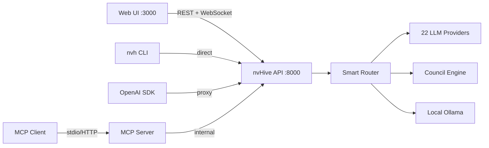

# nvHive

**Multi-LLM orchestration platform for NVIDIA GPUs and the cloud.**

     

## What is nvHive?

nvHive routes your questions to the right AI model automatically. It manages 22 providers and 63 models behind a single `nvh` command, picking the best advisor based on task type, cost, and privacy requirements. Simple questions stay local on your GPU (free, private). Complex questions route to the best cloud model. You can also convene a council of AI-generated expert personas to debate a decision, or poll every provider at once to compare answers. Twenty-five of the supported models are free with no credit card required.

## Platform Support

| Platform | GPU Support | Install |
|----------|-------------|---------|
| Linux (NVIDIA GPU) | Full (CUDA, pynvml) | `install.sh` or pip |
| macOS (Apple Silicon) | Metal via Ollama | `install-mac.sh` or pip |
| macOS (Intel) | CPU only | `pip install nvhive` |
| Windows (NVIDIA GPU) | Full (CUDA, pynvml) | `install.ps1` or pip |
| Windows (no GPU) | CPU only | `pip install nvhive` |
| Linux Desktop | Full (auto-detected) | `install.sh` |

## Quick Start

**Linux with GPU:**

```bash
curl -fsSL https://raw.githubusercontent.com/thatcooperguy/nvHive/main/install.sh | bash
```

**macOS:**

```bash
curl -fsSL https://raw.githubusercontent.com/thatcooperguy/nvHive/main/install-mac.sh | bash
```

**Windows (PowerShell):**

```powershell
iwr -useb https://raw.githubusercontent.com/thatcooperguy/nvHive/main/install.ps1 | iex
```

**Any platform (pip):**

```bash
python3 -m pip install nvhive
nvh setup                     # configure your first provider
nvh "What is machine learning?"
```

**From source:**

```bash
git clone https://github.com/thatcooperguy/nvHive.git
cd nvHive
pip install -e ".[dev]"
nvh doctor                    # verify everything works
```

## What Happens Automatically

When you install nvHive, everything configures itself:

```
Install runs:
  1. Detects your GPU (NVIDIA via pynvml, Apple Silicon via sysctl)
  2. Reads available VRAM / unified memory
  3. Downloads the right NVIDIA Nemotron model for your hardware:

     GPU Memory        Model Auto-Downloaded         Size    Speed
     ─────────────────────────────────────────────────────────────
     < 4 GB or CPU     nemotron-mini (4B)            ~2 GB   ~30 tok/s
     4–6 GB            nemotron-mini (GPU accel.)     ~2 GB   ~50 tok/s
     6–12 GB           nemotron-small (recommended)   ~5 GB   ~75 tok/s
     12–24 GB          nemotron-small + codellama     ~9 GB   ~110 tok/s
     24–48 GB          nemotron 70B (quantized)       ~40 GB  ~40 tok/s
     48–80 GB          nemotron 70B (full quality)    ~40 GB  ~120 tok/s
     80+ GB            nemotron 120B (flagship)       ~70 GB  ~180 tok/s

  4. Installs Ollama (local model server) — no root needed
  5. Creates config with Ollama + LLM7 (anonymous, free) enabled
  6. Pulls model in background — you can start chatting immediately
  7. Adds 'nvh' to your PATH

First time: ~60 seconds. Reconnect (new VM): ~3 seconds.
```

**You never pick a model.** The platform reads your hardware and downloads the best one. On Apple Silicon, it uses Metal via Ollama with unified memory. On NVIDIA, it uses CUDA. On CPU-only systems, it uses free cloud providers.

## Your First 60 Seconds

```
$ nvh "Explain Python decorators in 3 sentences"
╭─ nemotron-small (local, free) ──────────────────────────────────────╮
│ A decorator is a function that takes another function as input and  │
│ returns a modified version of it. You apply one with @decorator     │
│ syntax above a function definition. They're used for cross-cutting  │
│ concerns like logging, caching, and access control without          │
│ modifying the original function's code.                             │
╰─────────────────────────────────────── 0.4s · 52 tokens · $0.00 ───╯
```

No API keys needed for your first query -- nvHive defaults to free local or anonymous providers. Run `nvh setup` to add more providers when you are ready.

## Core Commands

### Essentials

| Command | Description |
|---------|-------------|
| `nvh "question"` | Smart default -- routes to the best available advisor |
| `nvh ask "question"` | Ask a specific advisor (use `-a provider`) |
| `nvh convene "question"` | Convene a council of AI-generated expert agents |
| `nvh poll "question"` | Ask every configured advisor, compare answers |
| `nvh throwdown "question"` | Two-pass deep analysis across all providers |
| `nvh quick "question"` | Fastest available model, minimal latency |
| `nvh safe "question"` | Local models only -- nothing leaves your machine |
| `nvh do "task"` | Detect action intent and execute (install, open, find) |

### Focus Modes

| Command | Description |
|---------|-------------|
| `nvh code "question"` | Code-optimized routing and prompts |
| `nvh write "question"` | Writing-optimized with style guidance |
| `nvh research "question"` | Multi-source research with citations |
| `nvh math "question"` | Math and reasoning, step-by-step |

### Tools

| Command | Description |
|---------|-------------|
| `nvh bench` | GPU benchmark -- measure tokens/second |
| `nvh scan` | Scan and index project files |
| `nvh learn "topic"` | Interactive learning sessions |
| `nvh clip` | Clipboard integration |
| `nvh voice` | Voice input/output |
| `nvh imagine "prompt"` | Image generation |
| `nvh screenshot` | Capture and analyze screenshots |
| `nvh git` | Git-aware operations |

### System

| Command | Description |
|---------|-------------|
| `nvh status` | Show configured providers, GPU, active model |
| `nvh savings` | Track how much you have saved with free/local models |
| `nvh debug` | Debug mode with verbose output |
| `nvh doctor` | Diagnose configuration and connectivity |
| `nvh setup` | Interactive provider setup wizard |
| `nvh keys` | Show all free API key signup links in one table |
| `nvh keys --open` | Open all free provider signup pages in browser |
| `nvh webui` | Install and launch the web UI (optional) |
| `nvh update` | Check for and install updates |
| `nvh version` | Print version |
| `nvh mcp` | Start MCP server (Claude Code, Cursor, OpenClaw) |
| `nvh openclaw` | Generate OpenClaw/NemoClaw tool config |
| `nvh nemoclaw` | NemoClaw integration setup guide |
| `nvh nemoclaw --test` | Test NemoClaw proxy connectivity |
| `nvh nemoclaw --start` | Start proxy server for NemoClaw |

### Management

| Command | Description |
|---------|-------------|
| `nvh advisor` | Manage advisor profiles and routing weights |
| `nvh agent` | Manage auto-generated expert agents and cabinets |
| `nvh config` | View and edit configuration |
| `nvh conversation` | List, export, or resume conversations |
| `nvh budget` | Set and monitor spending limits |
| `nvh model` | List, pull, or remove models |
| `nvh template` | Manage prompt templates |
| `nvh workflow` | Run multi-step YAML pipelines |
| `nvh knowledge` | Manage knowledge base entries |
| `nvh schedule` | Schedule recurring queries |
| `nvh webhook` | Configure webhook integrations |
| `nvh auth` | Manage API keys and authentication |
| `nvh plugins` | Install and manage plugins |
| `nvh serve` | Start the OpenAI-compatible API server |
| `nvh repl` | Launch interactive REPL |
| `nvh completions` | Generate shell completions |

### Direct Advisor Access

Skip the router and talk directly to a provider:

```bash
nvh openai "question"       # Route to OpenAI
nvh groq "question"         # Route to Groq
nvh google "question"       # Route to Gemini
nvh ollama "question"       # Route to local Ollama
```

Works for all 22 providers. Run `nvh <provider>` with no question to launch that provider's setup.

## How It Works

1. You type a question: `nvh "Should I use Redis or Postgres for sessions?"`
2. The **action detector** checks if this is a system action (install, open, find). If so, it executes directly -- no LLM needed.
3. If it is a question, the **router** classifies the task type, scores all configured advisors on relevance, cost, and speed, and picks the best one.
4. **Local-first**: simple queries stay on Nemotron via Ollama (free, private, no network).
5. **Cloud when needed**: complex or specialized queries route to the best cloud advisor.

Every response shows which advisor answered, how long it took, and what it cost.

## Local LLM Orchestration

The local Nemotron model doesn't just answer questions — it acts as an intelligent brain that orchestrates every cloud LLM call. All orchestration runs on your GPU for free.

### The Orchestrator's Role

When you ask a question, before any cloud API is called, the local model:

1. **Analyzes your query** — detects task type, complexity, privacy needs, and whether web access or code execution is required.
2. **Picks the best advisor** — goes beyond keyword matching to understand intent and route to the right cloud model.
3. **Rewrites your prompt** — optimizes wording for the target advisor's known strengths, reducing tokens and improving answer quality.
4. **Evaluates the response** — checks if the answer is complete and correct, and flags it for retry if not.
5. **Synthesizes locally** — when multiple advisors respond, merges their answers on your GPU instead of paying a cloud model to do it.
6. **Compresses conversation history** — summarizes long chats before sending context to cloud APIs, cutting token costs.

### Tiers

Orchestration scales automatically based on your GPU's available VRAM:

| Tier | VRAM Required | Features |
|------|--------------|----------|
| `off` | Any | Keyword routing, template agents (fallback mode) |
| `light` | 6 GB+ | Smart routing + prompt optimization |
| `full` | 20 GB+ | All features: routing, agents, eval, synthesis, compression |
| `auto` | — | Detects tier from available VRAM (default) |

With `auto` (the default), nvHive reads your GPU VRAM at startup and enables the highest tier your hardware supports. If no local model is available, the engine falls back gracefully to keyword-based routing — no errors, no configuration needed.

### Enabling and Disabling

```bash
# Show current orchestration mode
nvh config get defaults.orchestration_mode

# Disable orchestration (keyword routing only)
nvh config set defaults.orchestration_mode off

# Enable light mode (smart routing + prompt optimization)
nvh config set defaults.orchestration_mode light

# Enable full mode (all features)
nvh config set defaults.orchestration_mode full

# Auto-detect from VRAM (default)
nvh config set defaults.orchestration_mode auto
```

### Cost Impact

Every orchestration call runs on your local GPU — it costs nothing. The savings come indirectly:

- **Better routing** reduces expensive cloud calls by sending more queries to cheaper or local models.
- **Prompt optimization** sends fewer tokens to cloud APIs, directly reducing per-query cost.
- **Response evaluation** catches bad answers before you need to re-ask, avoiding retry costs.
- **Local synthesis** replaces cloud synthesis calls (the most expensive part of council mode) with free local inference.

## Supported AI Providers

| Provider | Free Tier | Best For | Models |
|----------|-----------|----------|--------|
| Ollama (Local) | Unlimited | Privacy, offline | nemotron, codellama, llama3 |
| LLM7 | 30 RPM, no signup | Anonymous, instant start | Multiple |
| Groq | 30 RPM free | Ultra-fast inference | llama3, mixtral, gemma |
| GitHub Models | 50-150 req/day | Free frontier models | GPT-4o, Llama, Mistral |
| Google Gemini | 15 RPM free | Long context, multimodal | Gemini 1.5 Pro/Flash |
| NVIDIA NIM | 1000 free credits | NVIDIA-optimized | Nemotron, Llama |
| Cerebras | 30 RPM free | Fast inference | Llama3 |
| SambaNova | Free tier | Llama models | Llama3 |
| Fireworks AI | Free tier | Fast open-source | Multiple |
| SiliconFlow | 1000 RPM free | High-throughput | Multiple |
| Hugging Face | Free API | Open-source models | Thousands |
| AI21 Labs | Free tier | Jamba models | Jamba |
| Mistral | 2 RPM free | Code | Mistral, Mixtral |
| Cohere | Trial key | RAG, embeddings | Command R+ |
| OpenAI | Paid | GPT-4o, reasoning | GPT-4o, o1, o3 |
| Anthropic | Paid | Analysis, coding | Claude 3.5/4 |
| DeepSeek | Very cheap | Code, reasoning | DeepSeek V3/R1 |
| Grok (xAI) | Paid | Real-time knowledge | Grok |
| Perplexity | Paid | Search-augmented | pplx-online |
| Together AI | Paid | Open-source models | Multiple |
| OpenRouter | Paid | Meta-router, fallback | All models |
| Mock | N/A | Unit tests | N/A |

**25 models are free** across 14 providers. Run `nvh setup` to configure any of them.

## GPU-Adaptive Model Selection

nvHive detects your GPU and automatically selects the best local model:

| GPU | VRAM | Best Local Model | Performance |
|-----|------|-------------------|-------------|
| No GPU | -- | Cloud only | Free tiers: LLM7, Groq, GitHub Models |
| GTX 1660 / RTX 2060 | 6 GB | nemotron-mini (4B) | ~30 tok/s |
| RTX 3060 | 12 GB | nemotron-small | ~55 tok/s |
| RTX 3070 / 3080 | 8-10 GB | nemotron-small | ~75 tok/s |
| RTX 3090 | 24 GB | nemotron-small + codellama | ~100 tok/s |
| RTX 4060 | 8 GB | nemotron-small | ~70 tok/s |
| RTX 4070 | 12 GB | nemotron-small | ~90 tok/s |
| RTX 4080 | 16 GB | nemotron-small + models | ~130 tok/s |
| RTX 4090 | 24 GB | nemotron 70B (Q4) | ~40 tok/s (70B) |
| RTX 5090 | 32 GB | nemotron 70B (Q4) | ~60 tok/s (70B) |
| A100 / H100 | 80 GB | nemotron 70B (full) | ~120-180 tok/s |

Models unload after inactivity to free VRAM for gaming. Run `nvh bench` to measure your actual throughput.

## Auto-Agent Council System

When you run `nvh convene`, nvHive analyzes your question and generates a panel of expert personas to debate it. Each agent has a defined role, expertise area, and analytical perspective.

**12 cabinets** with pre-configured expert panels:

| Cabinet | Experts |
|---------|---------|
| `executive` | CEO, CFO, CTO, Product Manager |
| `engineering` | Architect, Backend Engineer, DevOps/SRE, Security, QA |
| `security_review` | Security Engineer, DevOps/SRE, Architect, Legal/Compliance |
| `code_review` | Architect, Backend Engineer, QA, Performance Engineer |
| `product` | Product Manager, UX Designer, Engineering Manager, CEO |
| `data` | Data Engineer, DBA, ML/AI Engineer, Architect |
| `full_board` | CEO, CFO, CTO, Architect, Backend, DevOps, Security |
| `homework_help` | Patient Tutor, Devil's Advocate, Study Coach |
| `code_tutor` | Code Mentor, Bug Hunter, Best Practices Reviewer |
| `essay_review` | Writing Coach, Logic Checker, Style Editor |
| `study_group` | Socratic Questioner, ELI5 Explainer, Practice Problem Generator |
| `exam_prep` | Exam Coach, Flashcard Creator, Weak Spot Finder |

```bash
nvh convene "Should we migrate to microservices?" --cabinet engineering
nvh convene "Review my essay on climate policy" --cabinet essay_review
```

## Tool System

27 tools across six categories. 18 safe tools run automatically; 9 that modify state require confirmation.

| Category | Tools |
|----------|-------|
| **Files** | `read_file`, `write_file`, `list_files`, `search_files` |
| **Code** | `run_code`, `shell` |
| **System** | `list_processes`, `system_info`, `disk_usage`, `open_app`, `open_url` |
| **Packages** | `pip_install`, `pip_list`, `npm_install` |
| **Web** | `download`, `web_search` |
| **Clipboard** | `get_clipboard`, `set_clipboard` |
| **Notifications** | `notify` |

Enable tools per query with `--tools` or globally in the REPL with `/tools on`.

## Privacy and Safe Mode

Three privacy tiers:

- **Safe mode** (`nvh safe`): Local models only. Nothing leaves your machine. Use for sensitive data, salary info, proprietary code.
- **Local default**: Simple queries use local Ollama. Complex queries route to cloud with your consent.
- **Cloud**: Full access to all configured providers for maximum capability.

```bash
nvh safe "Analyze this salary spreadsheet"   # stays 100% local
nvh "Explain quantum computing"              # may route to cloud
```

## HIVE.md Context Injection

Create a `HIVE.md` file in any project directory. nvHive automatically injects it into the system prompt for every query made from that directory.

```markdown
# HIVE.md
This is a Python 3.12 FastAPI project using SQLAlchemy and PostgreSQL.
Follow Google Python Style Guide. Prefer async/await patterns.
Test with pytest. Deploy target: Ubuntu 22.04 on GKE.
```

Every advisor sees your project context automatically.

## Python SDK

```python
from nvh import ask, convene, poll, safe, quick

# Simple query
response = await ask("What is machine learning?")

# Specific advisor
response = await ask("Debug this code", advisor="anthropic")

# Council of experts
result = await convene("Should we use Rust?", cabinet="engineering")

# Poll all advisors
results = await poll("Write a sort function")

# Local only
response = await safe("Analyze my salary data")
```

Synchronous versions available: `ask_sync`, `convene_sync`.

## OpenAI-Compatible Proxy

Run nvHive as a drop-in backend for any tool that speaks the OpenAI API:

```bash
nvh serve --port 8000
```

Then point any OpenAI SDK client at `http://localhost:8000`:

```python
from openai import OpenAI
client = OpenAI(base_url="http://localhost:8000/v1", api_key="nvhive")
response = client.chat.completions.create(
    model="auto",  # nvHive picks the best model
    messages=[{"role": "user", "content": "Hello"}]
)
```

## MCP Server (Claude Code, Cursor, OpenClaw)

nvHive exposes its tools via the [Model Context Protocol](https://modelcontextprotocol.io/), making them available to Claude Code, Cursor, OpenClaw, and any MCP-compatible client.

```bash
# Install MCP support
pip install "nvhive[mcp]"

# Register with Claude Code
claude mcp add nvhive nvh mcp

# Or start as HTTP server for remote clients
nvh mcp -t streamable-http --port 8080
```

Tools available via MCP: `ask`, `ask_safe`, `council`, `throwdown`, `status`, `list_advisors`, `list_cabinets`.

For OpenClaw agents, generate the config:

```bash
nvh openclaw              # creates openclaw.json with nvHive MCP config
nvh openclaw --agent      # generates NemoClaw agent config
```

## NemoClaw Integration

nvHive works as an inference provider inside [NVIDIA NemoClaw](https://github.com/NVIDIA/NemoClaw), giving NemoClaw agents access to multi-model smart routing, council consensus, and throwdown analysis.

```bash
# Setup in three commands:
nvh nemoclaw --start                     # 1. Start nvHive proxy
openshell provider create \              # 2. Register with NemoClaw
    --name nvhive --type openai \
    --credential OPENAI_API_KEY=nvhive \
    --config OPENAI_BASE_URL=http://host.openshell.internal:8000/v1/proxy
openshell inference set \                # 3. Set as default
    --provider nvhive --model auto
```

NemoClaw agents can request any virtual model:

| Model | What It Does |
|-------|-------------|
| `auto` | Smart routing — best provider for the query |
| `safe` | Local only — nothing leaves your machine |
| `council` | 3-model consensus with synthesis |
| `council:N` | N-model council (2-10 members) |
| `throwdown` | Two-pass deep analysis with critique |

Privacy-aware routing: set `x-nvhive-privacy: local-only` header to force all inference through local Ollama, integrating with NemoClaw's content sensitivity routing.

```
NemoClaw Sandbox → OpenShell Gateway → nvHive Proxy → 22 providers
                                          ↓
                          Smart Router / Council / Throwdown
```

Run `nvh nemoclaw` for the full setup guide, or `nvh nemoclaw --test` to verify connectivity.

## Configuration

Configuration lives at `~/.config/nvhive/config.yaml`. Manage it with:

```bash
nvh config                    # view current config
nvh config set default_advisor groq
nvh config set safe_mode true
nvh budget set --daily 1.00   # daily spending cap
```

## Workflows

Define multi-step pipelines in YAML:

```yaml
name: Code Review Pipeline
steps:
  - name: security_scan
    action: ask
    prompt: "Analyze for security vulnerabilities:\n\n{{input}}"
    advisor: anthropic
    save_as: security

  - name: quality_review
    action: ask
    prompt: "Review for quality and best practices:\n\n{{input}}"
    advisor: openai
    save_as: quality

  - name: synthesis
    action: convene
    prompt: "Synthesize findings:\n\nSecurity: {{security}}\nQuality: {{quality}}"
    cabinet: code_review
    save_as: summary
```

```bash
nvh workflow run code_review.yaml --input "$(cat main.py)"
```

## For Students

nvHive was built with students in mind. Five dedicated cabinets teach rather than just answer:

- **homework_help** -- Patient Tutor, Devil's Advocate, and Study Coach guide you to understanding
- **code_tutor** -- Code Mentor, Bug Hunter, and Best Practices Reviewer teach programming
- **essay_review** -- Writing Coach, Logic Checker, and Style Editor improve your writing
- **study_group** -- Socratic Questioner, ELI5 Explainer, and Practice Problem Generator
- **exam_prep** -- Exam Coach, Flashcard Creator, and Weak Spot Finder

All work with free models. Track your savings with `nvh savings`.

```bash
nvh convene "Explain recursion step by step" --cabinet code_tutor
nvh convene "Help me prepare for my calculus final" --cabinet exam_prep
```

## For Linux Desktop

nvHive is designed for deployment on Linux Desktop instances:

- Auto-detects cloud sessions and adapts to the available GPU tier
- All tools operate at user level -- no root, no sudo
- Session-aware: handles ephemeral environments with mounted home directories
- Auto-healing: reconnects to Ollama if the instance restarts
- GPU VRAM management: models unload after inactivity so games can reclaim VRAM

## Web Interface

nvHive includes a full web dashboard for users who prefer a visual experience over the CLI. Launch it with:

```bash
nvh webui
```

The dashboard opens at `http://localhost:3000` and connects to the nvHive API automatically.

### Pages

| Page | What It Does |
|------|-------------|
| **Chat** | Send prompts in single, council, or compare mode with streaming responses |
| **Council** | Real-time multi-LLM orchestration with live member progress and synthesis |
| **Query Builder** | Advanced query form with provider/model filters and agent presets |
| **Advisors** | Provider health status, model listings, and connectivity testing |
| **Integrations** | Auto-detect and connect NemoClaw, OpenClaw, Claude Code, Cursor |
| **System** | GPU info, cache stats, budget status, and recommendations |
| **Settings** | API URL, defaults, budget limits, theme, and council strategy |
| **Setup Wizard** | Step-by-step onboarding: GPU detection, local AI, cloud providers |

### Design

- NVIDIA-inspired dark theme with green (#76B900) accents
- Angular design language with diamond status indicators
- Command palette (Ctrl+K) for quick navigation
- Real-time streaming via SSE and WebSocket
- Responsive layout for desktop and mobile
- Keyboard shortcuts throughout (Ctrl+N, Ctrl+B, Ctrl+/)

### Screenshots

| Chat Interface | Integrations |
|:-:|:-:|
|  |  |

| Council Mode | System Dashboard |
|:-:|:-:|
|  |  |

| Advisors | Setup Wizard |
|:-:|:-:|
|  |  |

### Architecture Diagram



## Architecture

```
nvh CLI
  |
  +-- Action Detector -----> Direct execution (install, open, find)
  |
  +-- Router
  |     |-- Task classifier (code, writing, research, math, general)
  |     |-- Advisor scorer (relevance, cost, speed, privacy)
  |     +-- Model selector (GPU VRAM, provider availability)
  |
  +-- Providers (22)
  |     |-- Local: Ollama (Nemotron, CodeLlama, Llama3)
  |     |-- Cloud: OpenAI, Anthropic, Google, Groq, ...
  |     +-- Free: LLM7, GitHub Models, NVIDIA NIM, ...
  |
  +-- Agent System
  |     |-- Auto-generation from query analysis
  |     +-- 12 pre-built cabinets (22 expert personas)
  |
  +-- Tool System (27 tools, 18 safe / 9 confirm)
  |
  +-- SDK + OpenAI-compatible API server
```

## Project Stats

| Metric | Value |
|--------|-------|
| Python files | 81 |
| Lines of code | 27,518 |
| Functions | 810 |
| Tests | 181 |
| Providers | 22 |
| Models | 63 (25 free) |
| Tools | 27 (18 safe, 9 confirm) |
| Cabinets | 12 |
| Expert personas | 22 |
| Wheel size | 276 KB |
| Commits | 42 |

## Documentation

| Document | Description |
|----------|-------------|
| [Getting Started](docs/GETTING_STARTED.md) | First-time setup and usage guide |
| [Hardware Requirements](docs/HARDWARE.md) | GPU tiers, VRAM mapping, performance |
| [Testing Guide](docs/TESTING_GUIDE.md) | Running and writing tests |
| [EULA](EULA.md) | End User License Agreement |
| [Privacy Policy](PRIVACY.md) | Data handling and privacy |
| [Changelog](CHANGELOG.md) | Version history |

## Contributing

See [CONTRIBUTING.md](CONTRIBUTING.md) for development setup, coding standards, and pull request guidelines.

## License

MIT License. See [LICENSE](LICENSE) for details.
