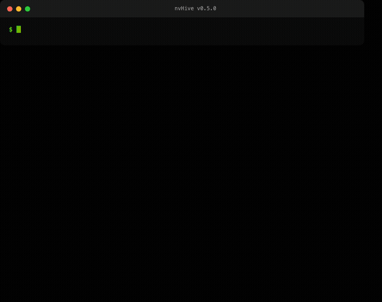
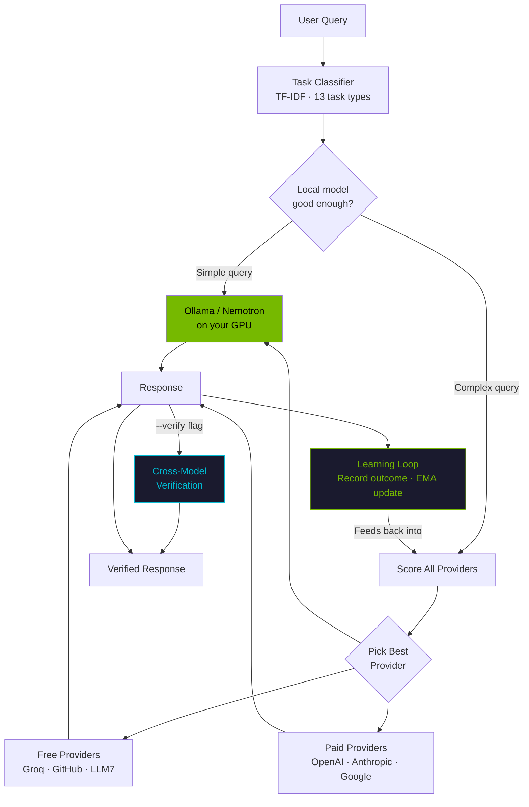
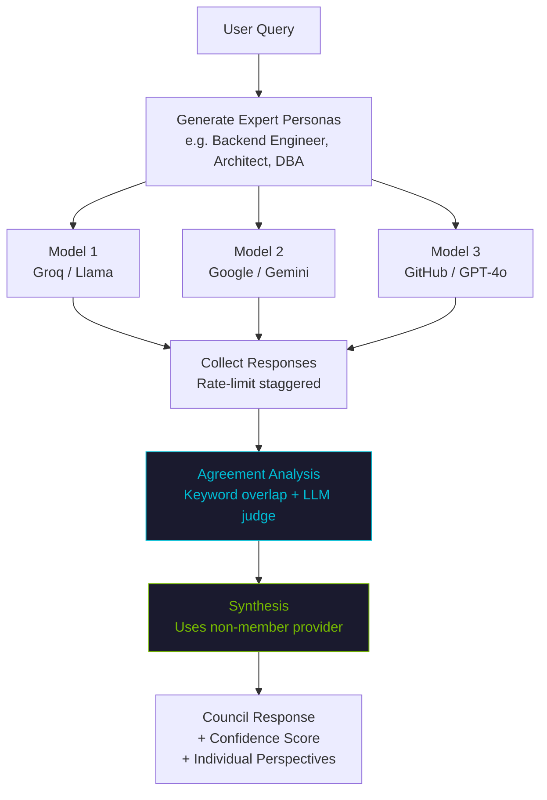
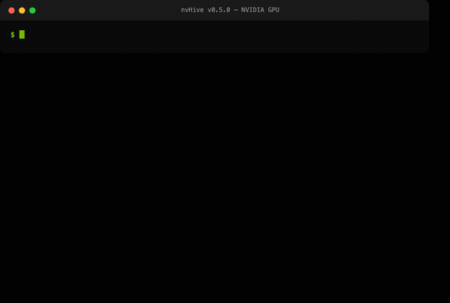
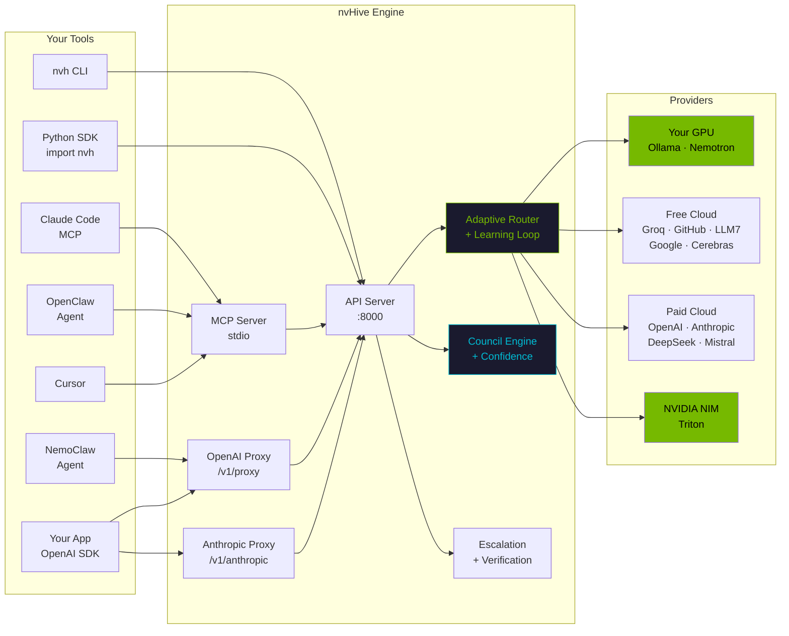

# nvHive

**Multi-provider LLM routing that learns from every query.**

     

## Why nvHive

Most AI tools use a single provider. When that provider hits rate limits, changes pricing, or goes down, you're stuck.

nvHive routes queries to the best available provider automatically. It tracks which providers actually perform well for which task types, and adjusts routing based on measured quality — not static config.

**What makes it different:**
- **Learns from every query.** The router measures real provider performance. By 20 queries it's routing based on data, not guesses.
- **Council consensus.** 3+ models collaborate and synthesize. Different models catch different blind spots.
- **Confidence-gated escalation.** Tries a free model first. Escalates to premium only if the response is uncertain.
- **Cross-model verification.** A second model independently checks for errors and hallucinations.

<p align="center">
  
</p>

<p align="center">
  
</p>

---

## Get Started

```bash
pip install nvhive
nvh setup              # configure providers (validates keys)
nvh health             # check what's available
nvh "your question"    # try it
```

Works immediately with LLM7 (no signup). Run `nvh setup` to add free providers like Groq and GitHub Models.

---

## How It Works

### Query Pipeline


```mermaid
flowchart TB
    USER[User Query] --> CLASSIFY[Task Classifier<br/>TF-IDF · 13 task types]
    CLASSIFY --> LOCALCHECK{Local model<br/>good enough?}
    
    LOCALCHECK -->|Simple query| LOCAL[Ollama / Nemotron<br/>on your GPU]
    LOCALCHECK -->|Complex query| SCORE[Score All Providers]
    
    SCORE --> ROUTE{Pick Best<br/>Provider}
    
    ROUTE --> FREE[Free Providers<br/>Groq · GitHub · LLM7]
    ROUTE --> PAID[Paid Providers<br/>OpenAI · Anthropic · Google]
    ROUTE --> LOCAL
    
    FREE --> RESPONSE[Response]
    PAID --> RESPONSE
    LOCAL --> RESPONSE
    
    RESPONSE --> LEARN[Learning Loop<br/>Record outcome · EMA update]
    LEARN -->|Feeds back into| SCORE
    
    RESPONSE -->|--verify flag| VERIFY[Cross-Model<br/>Verification]
    VERIFY --> FINAL[Verified Response]
    RESPONSE --> FINAL
    
    style LOCAL fill:#76B900,color:#000
    style LEARN fill:#1a1a2e,color:#76B900,stroke:#76B900
    style VERIFY fill:#1a1a2e,color:#00bcd4,stroke:#00bcd4
```

**Task classification:** TF-IDF cosine similarity against a 90-example training corpus (13 task types). Semantic understanding, not keyword matching.

**Provider scoring:** Weighted composite — capability (40%), cost (30%), latency (20%), health (10%). Capability scores start from static estimates and converge to measured performance via exponential moving average.

**Adaptive learning:** After every query, nvHive records the outcome and updates scores. By 20 queries per provider/task pair, routing is fully data-driven.

```bash
nvh routing-stats    # see learned vs static scores
nvh health           # provider resilience dashboard
```

**Failover:** If a provider fails, nvHive tries the next in the fallback chain. Every failure feeds back into the health score.

**Local-first with NVIDIA GPUs:** Simple queries route to Nemotron on your NVIDIA GPU via Ollama — no cloud, no cost, no data leaving your machine. GPU detection via pynvml reads VRAM, driver version, and CUDA version to select the optimal local model. The `--prefer-nvidia` flag gives a 1.3x routing bonus to keep inference on NVIDIA hardware whenever quality allows.

---

## Council Mode


```mermaid
flowchart TB
    QUERY[User Query] --> AGENTS[Generate Expert Personas<br/>e.g. Backend Engineer, Architect, DBA]
    
    AGENTS --> M1[Model 1<br/>Groq / Llama]
    AGENTS --> M2[Model 2<br/>Google / Gemini]
    AGENTS --> M3[Model 3<br/>GitHub / GPT-4o]
    
    M1 --> COLLECT[Collect Responses<br/>Rate-limit staggered]
    M2 --> COLLECT
    M3 --> COLLECT
    
    COLLECT --> AGREE[Agreement Analysis<br/>Keyword overlap + LLM judge]
    AGREE --> SYNTH[Synthesis<br/>Uses non-member provider]
    
    SYNTH --> RESULT[Council Response<br/>+ Confidence Score<br/>+ Individual Perspectives]
    
    style AGREE fill:#1a1a2e,color:#00bcd4,stroke:#00bcd4
    style SYNTH fill:#1a1a2e,color:#76B900,stroke:#76B900
```

When one model isn't enough, nvHive runs the same query through multiple providers in parallel, then synthesizes their responses.

**Why this works:** Different models have different blind spots. Council mode surfaces all perspectives and synthesizes the best of each.

**Confidence scoring:** Every council response includes an agreement metric — "3/3 agreed" vs "split decision." Tells you when to trust the consensus.

**Cost:** Council with 3 free providers costs $0. Council with 3 Nemotron variants on a single NVIDIA GPU costs $0 and never leaves your machine. Premium cloud council costs ~3x a single query.

```bash
nvh convene "Should we use Redis or Postgres for session storage?"
# → 3 models debate → synthesis with confidence score

nvh throwdown "Review this architecture for scalability issues"
# → Pass 1: 3 models analyze → Pass 2: critique each other → final synthesis
```

---

## Smart Query Features

```bash
# Confidence-gated escalation: try free first, upgrade only if needed
nvh ask --escalate "Design a distributed lock manager"
# → groq (free, confidence: 42%) → auto-escalated to openai

# Cross-model verification: a second model checks the answer
nvh ask --verify "Is eval() safe in Python?"
# → groq answers → google verifies ✓ (9/10, no issues)

# Both together: cheapest possible verified answer
nvh ask --escalate --verify "Explain the CAP theorem"
```

---

## Local GPU Inference with Nemotron

nvHive auto-detects your GPU and routes to [NVIDIA Nemotron](https://build.nvidia.com/nvidia/nemotron-mini) running locally via Ollama. Simple queries hit your GPU by default — no cloud, no cost, no data leaving your machine.

<p align="center">
  
</p>

```bash
curl -fsSL https://ollama.com/install.sh | sh
ollama pull nemotron-mini
# nvHive detects it automatically
```

**What happens automatically:**
1. nvHive detects your GPU (NVIDIA via pynvml, Apple Silicon via system)
2. Finds Ollama → registers Nemotron as a provider
3. Simple queries route to Nemotron locally
4. Complex queries escalate to cloud when needed
5. The learning loop measures Nemotron's quality and adjusts thresholds

| Provider | Hardware | Use Case |
|----------|----------|----------|
| Ollama/Nemotron | Consumer GPUs (RTX 3060+, 8GB+ VRAM) | Default local inference |
| NVIDIA NIM | Cloud API (1000 free credits on signup) | Specialized models |
| Triton Server | Enterprise GPUs (H100/A100) | Production multi-model serving |

---

## Integrations

### How nvHive Connects to Your Tools


```mermaid
flowchart LR
    subgraph Your Tools
        CLI[nvh CLI]
        SDK[Python SDK<br/>import nvh]
        CC[Claude Code<br/>MCP]
        OC[OpenClaw<br/>Agent]
        NC[NemoClaw<br/>Agent]
        CU[Cursor]
        APP[Your App<br/>OpenAI SDK]
    end

    subgraph nvHive Engine
        API[API Server<br/>:8000]
        MCP[MCP Server<br/>stdio]
        PROXY_OAI[OpenAI Proxy<br/>/v1/proxy]
        PROXY_ANT[Anthropic Proxy<br/>/v1/anthropic]
        ROUTER[Adaptive Router<br/>+ Learning Loop]
        COUNCIL[Council Engine<br/>+ Confidence]
        ESCALATE[Escalation<br/>+ Verification]
    end

    subgraph Providers
        GPU[Your GPU<br/>Ollama · Nemotron]
        FREE_P[Free Cloud<br/>Groq · GitHub · LLM7<br/>Google · Cerebras]
        PAID_P[Paid Cloud<br/>OpenAI · Anthropic<br/>DeepSeek · Mistral]
        NIM[NVIDIA NIM<br/>Triton]
    end

    CLI --> API
    SDK --> API
    CC --> MCP
    OC --> MCP
    NC --> PROXY_OAI
    CU --> MCP
    APP --> PROXY_OAI
    APP --> PROXY_ANT

    MCP --> API
    PROXY_OAI --> API
    PROXY_ANT --> API
    API --> ROUTER
    API --> COUNCIL
    API --> ESCALATE
    ROUTER --> GPU
    ROUTER --> FREE_P
    ROUTER --> PAID_P
    ROUTER --> NIM

    style GPU fill:#76B900,color:#000
    style NIM fill:#76B900,color:#000
    style ROUTER fill:#1a1a2e,color:#76B900,stroke:#76B900
    style COUNCIL fill:#1a1a2e,color:#00bcd4,stroke:#00bcd4
```

**API Proxies** — point existing SDKs at nvHive:

| SDK | Configuration |
|-----|--------------|
| Anthropic | `ANTHROPIC_BASE_URL=http://localhost:8000/v1/anthropic` |
| OpenAI | `OPENAI_BASE_URL=http://localhost:8000/v1/proxy` |
| Claude Code | `claude mcp add nvhive -- python -m nvh.mcp_server` |
| Cursor | `nvh integrate --auto` |

### Works With OpenClaw & NemoClaw

nvHive works alongside OpenClaw as a routing layer, and integrates with [NemoClaw](docs/NEMOCLAW.md) (NVIDIA's agent framework) as both inference provider and MCP tool server.

```bash
nvh migrate --from openclaw    # import your existing API keys
nvh nemoclaw --start           # start proxy for NemoClaw agents
```

*Note: Anthropic recently changed billing for third-party tools. See the [integration guide](docs/OPENCLAW_MIGRATION.md) for details.*

---

## For Tool Builders

nvHive is a routing layer. Any AI application can add multi-provider routing:

```python
import nvh

# Drop-in OpenAI-compatible interface
response = await nvh.complete([
    {"role": "user", "content": "Explain quicksort"}
])

# Inspect routing without executing
decision = await nvh.route("complex question about databases")

# Council consensus
result = await nvh.convene("Architecture review", cabinet="engineering")

# Provider health check
status = await nvh.health()
```

[SDK & API reference](docs/SDK_API.md)

---

## Core Commands

| Command | What It Does |
|---------|-------------|
| `nvh "question"` | Smart route to best available model |
| `nvh convene "question"` | Council consensus (3+ models) |
| `nvh throwdown "question"` | Two-pass deep analysis with critique |
| `nvh safe "question"` | Local only — nothing leaves your machine |
| `nvh ask --escalate` | Try free first, escalate if uncertain |
| `nvh ask --verify` | Cross-model verification |
| `nvh health` | Provider resilience dashboard |
| `nvh routing-stats` | Learned vs static routing scores |
| `nvh benchmark` | Quality benchmark suite |
| `nvh nvidia` | NVIDIA GPU infrastructure status |
| `nvh migrate` | Import keys from OpenClaw / Claude Desktop |
| `nvh setup` | Interactive provider setup |

[Full command reference](docs/COMMANDS.md) (50+ commands)

## Providers

**23 providers. 63 models. 25 free — no credit card required.**

| Tier | Providers | Rate Limits |
|------|-----------|-------------|
| **Free (no signup)** | Ollama (local), LLM7 | Unlimited / 30 RPM |
| **Free (email signup)** | Groq, GitHub Models, Cerebras, SambaNova, Cohere, AI21, SiliconFlow, HuggingFace | 15-30 RPM |
| **Free (account)** | Google Gemini, Mistral, NVIDIA NIM | 15-1000 RPM |
| **Paid** | OpenAI, Anthropic, DeepSeek, Fireworks, Together, OpenRouter, Grok | Pay per token |

---

## Verify It Yourself

```bash
nvh benchmark --mode council-free     # free council vs single model
nvh benchmark --mode all --export results.md
nvh health                            # provider resilience
nvh routing-stats                     # learning in action
```

16 prompts across code generation, debugging, reasoning, math, creative writing, and Q&A. Blind LLM judge. Run it yourself. Publish the results.

## Learn More

| Guide | Description |
|-------|-------------|
| [Getting Started](docs/GETTING_STARTED.md) | First-time setup |
| [Commands](docs/COMMANDS.md) | Full CLI reference (50+ commands) |
| [Providers](docs/PROVIDERS.md) | 23 providers, rate limits, free tiers |
| [Council System](docs/COUNCIL.md) | Multi-LLM consensus with confidence scoring |
| [OpenClaw Integration](docs/OPENCLAW_MIGRATION.md) | Works alongside OpenClaw |
| [Claude Code](docs/CLAUDE_CODE_INTEGRATION.md) | MCP server setup |
| [NemoClaw](docs/NEMOCLAW.md) | NVIDIA NemoClaw integration |
| [SDK & API](docs/SDK_API.md) | Python SDK, REST API, proxies |
| [Architecture](docs/ARCHITECTURE.md) | System design and adaptive learning |

## License

MIT License. See [LICENSE](LICENSE) for details.
