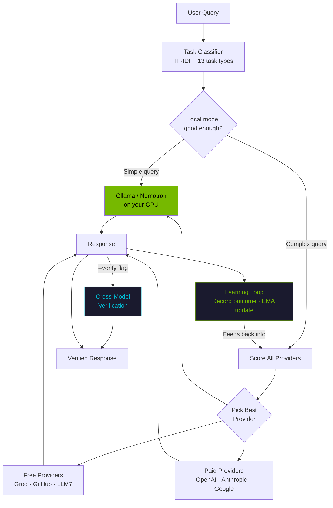
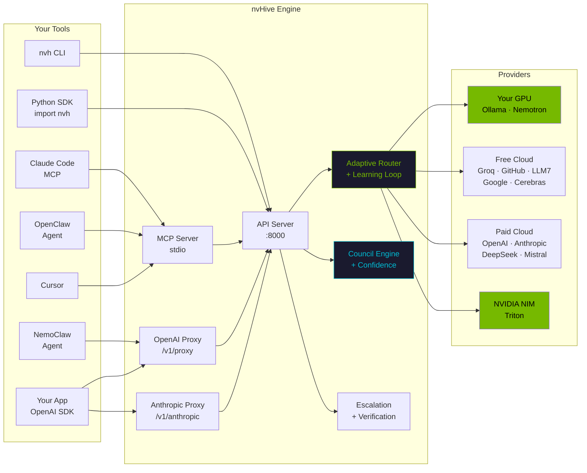
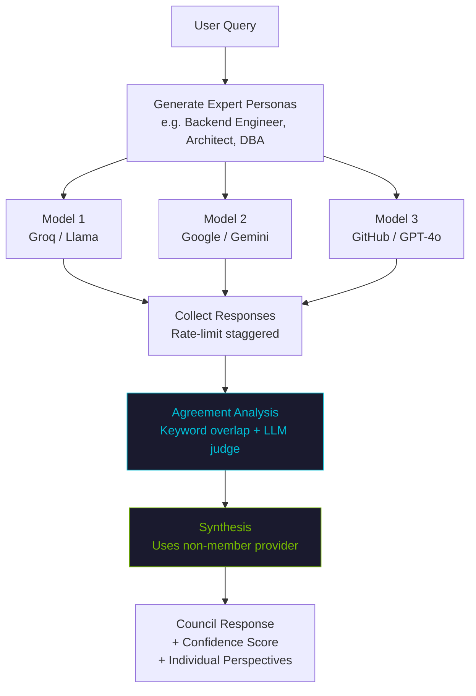

# nvHive

**Multi-provider LLM routing that learns from every query.**

     

nvHive routes LLM queries across 23 providers. It tracks which providers actually perform well for which task types, and adjusts routing based on measured quality — not static config. When a provider is rate-limited, down, or underperforming, queries automatically fail over to the next best option.

```bash
pip install nvhive
nvh "What is machine learning?"
# → Routed to groq/llama-3.3-70b (free, 520ms)
```

Works immediately with LLM7 (no signup). Run `nvh setup` to add free providers like Groq and GitHub Models.

<p align="center">
  
</p>

<p align="center">
  
</p>

---

## Why nvHive

**The problem:** Most AI tools use a single provider. When that provider hits rate limits, changes pricing, or goes down, you're stuck.

**What nvHive does:** Routes queries to the best available provider automatically. Simple queries go to free models. Complex queries go to premium models. If a provider fails, the next one picks up.

**What makes it different:**
- **Learns from every query.** The router tracks which providers actually deliver for which task types. By 20 queries it's routing based on measured performance, not guesses.
- **Council consensus.** When one model isn't enough, 3+ models collaborate and synthesize. Different models catch different blind spots.
- **Confidence-gated escalation.** Tries a free model first. If the response is uncertain, automatically escalates to a premium model. You only pay for quality when you need it.
- **Cross-model verification.** A second model independently checks the first model's answer for errors and hallucinations.

---

## Works With OpenClaw

nvHive works alongside OpenClaw as a routing layer. OpenClaw handles agent
orchestration — nvHive handles provider selection, picking the right model
for each query based on task type and measured quality.

```bash
pip install nvhive
nvh migrate --from openclaw    # import your existing API keys
nvh health                     # see available providers
```

**How they work together:**
- OpenClaw manages your agent workflow and tools
- nvHive sits behind it as the routing layer
- Each query goes to the provider best suited for the task type
- Free providers handle simple queries at no cost
- Premium providers handle complex queries when quality requires it

*Note: Anthropic recently changed billing for third-party tools.
See the [integration guide](docs/OPENCLAW_MIGRATION.md) for details.*

**For NemoClaw users** — nvHive plugs directly into OpenShell Gateway as an inference provider:
```bash
nvh nemoclaw --start
# NemoClaw agents route through 23 providers + your local GPU
```

[Full integration guide](docs/OPENCLAW_MIGRATION.md)

---

## How the Router Works

Most LLM routers use static config: "send code questions to GPT-4, everything else to Claude." nvHive is different — it measures actual performance and adapts.

**Task classification:** TF-IDF cosine similarity against a 90-example training corpus (13 task types). Not keyword matching — semantic understanding of what your query needs. Falls back to regex for edge cases.

**Provider scoring:** Weighted composite of four signals:
- **Capability** (40%): How good is this provider at this task type? Starts from static estimates, converges to measured scores via exponential moving average as queries flow.
- **Cost** (30%): Cheaper providers score higher. Free providers score maximum.
- **Latency** (20%): Faster providers score higher. Measured from actual response times.
- **Health** (10%): Circuit breaker tracks recent failures. Unhealthy providers get deprioritized automatically.

**Adaptive learning loop:** After every query, nvHive records the outcome (quality evaluation, latency, success/failure) and updates the provider's capability score for that task type. By 20 queries per provider/task pair, routing is fully data-driven — the static estimates are replaced by measured performance.

```bash
# See what the router has learned
nvh routing-stats

# Provider  Task Type        Static  Learned  Samples  Delta
# groq      code_generation   0.78    0.84      67     +0.06
# openai    reasoning         0.85    0.82      18     -0.03
```

**Failover:** If a provider fails, nvHive tries the next in the fallback chain. It prefers providers NOT already used in the current session (to avoid hitting the same rate limit). Every failure is recorded and feeds back into the health score.

**Local-first:** Queries estimated under 500 tokens on task types the local model handles well (conversation, Q&A, summarization) route to Ollama/Nemotron on your GPU. No network, no cost, no data leaving your machine. Complex queries escalate to cloud.

### Query Pipeline


```mermaid
flowchart TB
    USER[User Query] --> CLASSIFY[Task Classifier<br/>TF-IDF · 13 task types]
    CLASSIFY --> LOCALCHECK{Local model<br/>good enough?}
    
    LOCALCHECK -->|Simple query| LOCAL[Ollama / Nemotron<br/>on your GPU]
    LOCALCHECK -->|Complex query| SCORE[Score All Providers]
    
    SCORE --> ROUTE{Pick Best<br/>Provider}
    
    ROUTE --> FREE[Free Providers<br/>Groq · GitHub · LLM7]
    ROUTE --> PAID[Paid Providers<br/>OpenAI · Anthropic · Google]
    ROUTE --> LOCAL
    
    FREE --> RESPONSE[Response]
    PAID --> RESPONSE
    LOCAL --> RESPONSE
    
    RESPONSE --> LEARN[Learning Loop<br/>Record outcome · EMA update]
    LEARN --> |Feeds back into| SCORE
    
    RESPONSE -->|--verify flag| VERIFY[Cross-Model<br/>Verification]
    VERIFY --> FINAL[Verified Response]
    RESPONSE --> FINAL
    
    style LOCAL fill:#76B900,color:#000
    style LEARN fill:#1a1a2e,color:#76B900,stroke:#76B900
    style VERIFY fill:#1a1a2e,color:#00bcd4,stroke:#00bcd4
```

### How nvHive Connects to Your Tools


```mermaid
flowchart LR
    subgraph Your Tools
        CLI[nvh CLI]
        SDK[Python SDK<br/>import nvh]
        CC[Claude Code<br/>MCP]
        OC[OpenClaw<br/>Agent]
        NC[NemoClaw<br/>Agent]
        CU[Cursor]
        APP[Your App<br/>OpenAI SDK]
    end

    subgraph nvHive Engine
        API[API Server<br/>:8000]
        MCP[MCP Server<br/>stdio]
        PROXY_OAI[OpenAI Proxy<br/>/v1/proxy]
        PROXY_ANT[Anthropic Proxy<br/>/v1/anthropic]
        ROUTER[Adaptive Router<br/>+ Learning Loop]
        COUNCIL[Council Engine<br/>+ Confidence]
        ESCALATE[Escalation<br/>+ Verification]
    end

    subgraph Providers
        GPU[Your GPU<br/>Ollama · Nemotron]
        FREE_P[Free Cloud<br/>Groq · GitHub · LLM7<br/>Google · Cerebras]
        PAID_P[Paid Cloud<br/>OpenAI · Anthropic<br/>DeepSeek · Mistral]
        NIM[NVIDIA NIM<br/>Triton]
    end

    CLI --> API
    SDK --> API
    CC --> MCP
    OC --> MCP
    NC --> PROXY_OAI
    CU --> MCP
    APP --> PROXY_OAI
    APP --> PROXY_ANT

    MCP --> API
    PROXY_OAI --> API
    PROXY_ANT --> API
    API --> ROUTER
    API --> COUNCIL
    API --> ESCALATE
    ROUTER --> GPU
    ROUTER --> FREE_P
    ROUTER --> PAID_P
    ROUTER --> NIM

    style GPU fill:#76B900,color:#000
    style NIM fill:#76B900,color:#000
    style ROUTER fill:#1a1a2e,color:#76B900,stroke:#76B900
    style COUNCIL fill:#1a1a2e,color:#00bcd4,stroke:#00bcd4
```

### Council Consensus Pipeline


```mermaid
flowchart TB
    QUERY[User Query] --> AGENTS[Generate Expert Personas<br/>e.g. Backend Engineer, Architect, DBA]
    
    AGENTS --> M1[Model 1<br/>Groq / Llama]
    AGENTS --> M2[Model 2<br/>Google / Gemini]
    AGENTS --> M3[Model 3<br/>GitHub / GPT-4o]
    
    M1 --> COLLECT[Collect Responses<br/>Rate-limit staggered]
    M2 --> COLLECT
    M3 --> COLLECT
    
    COLLECT --> AGREE[Agreement Analysis<br/>Keyword overlap + LLM judge]
    AGREE --> SYNTH[Synthesis<br/>Uses non-member provider]
    
    SYNTH --> RESULT[Council Response<br/>+ Confidence Score<br/>+ Individual Perspectives]
    
    style AGREE fill:#1a1a2e,color:#00bcd4,stroke:#00bcd4
    style SYNTH fill:#1a1a2e,color:#76B900,stroke:#76B900
```

---

## Council Mode

When one model isn't enough, nvHive runs the same query through multiple providers in parallel, then synthesizes their responses into a single answer.

**Why this works:** Different models have different strengths and blind spots. GPT-4o might miss a security issue that Llama catches. Claude might structure an answer better but miss an edge case. Council mode surfaces all perspectives and synthesizes the best of each.

**What it costs:** Council with 3 free providers (Groq + GitHub + Google) costs $0. Council with 3 premium providers costs roughly 3x a single query. The synthesis step uses a provider NOT used as a council member to avoid rate limit conflicts.

**Confidence scoring:** Every council response includes an agreement metric: "3/3 agreed on core approach" vs "split decision — 2 models recommend X, 1 recommends Y." This tells you when to trust the consensus and when to dig deeper.

```bash
nvh convene "Should we use Redis or Postgres for session storage?"
# → 3 models debate → synthesis with confidence score

nvh throwdown "Review this architecture for scalability issues"
# → Pass 1: 3 models analyze → Pass 2: critique each other → final synthesis
```

**Rate-limit aware:** Council members sharing the same provider are staggered by 2 seconds. Synthesis retries across different providers with backoff if rate-limited. Designed to work reliably on free tiers.

---

## Smart Query Features

```bash
# Confidence-gated escalation: try free first, upgrade only if needed
nvh ask --escalate "Design a distributed lock manager"
# → groq (free, confidence: 42%) → auto-escalated to openai

# Cross-model verification: a second model checks the answer
nvh ask --verify "Is eval() safe in Python?"
# → groq answers → google verifies ✓ (9/10, no issues)

# Both together: cheapest possible verified answer
nvh ask --escalate --verify "Explain the CAP theorem"
```

---

## Core Commands

| Command | What It Does |
|---------|-------------|
| `nvh "question"` | Smart route to best available model |
| `nvh convene "question"` | Council consensus (3+ models) |
| `nvh throwdown "question"` | Two-pass deep analysis with critique |
| `nvh safe "question"` | Local only — nothing leaves your machine |
| `nvh ask --escalate` | Try free first, escalate if uncertain |
| `nvh ask --verify` | Cross-model verification |
| `nvh health` | Provider resilience dashboard |
| `nvh routing-stats` | Learned vs static routing scores |
| `nvh benchmark` | Quality benchmark suite (16 prompts, blind judge) |
| `nvh nvidia` | NVIDIA GPU infrastructure status |
| `nvh migrate` | Import keys from OpenClaw / Claude Desktop |
| `nvh setup` | Interactive provider setup (validates keys on save) |

[Full command reference](docs/COMMANDS.md) (50+ commands)

## Providers

**23 providers. 63 models. 25 free — no credit card required.**

| Tier | Providers | Rate Limits |
|------|-----------|-------------|
| **Free (no signup)** | Ollama (local), LLM7 | Unlimited / 30 RPM |
| **Free (email signup)** | Groq, GitHub Models, Cerebras, SambaNova, Cohere, AI21, SiliconFlow, HuggingFace | 15-30 RPM |
| **Free (account)** | Google Gemini, Mistral, NVIDIA NIM | 15-1000 RPM |
| **Paid** | OpenAI, Anthropic, DeepSeek, Fireworks, Together, OpenRouter, Grok | Pay per token |

Run `nvh setup` to configure. The router handles the rest.

---

## For Tool Builders

nvHive is a routing layer. Any AI application can add multi-provider routing:

```python
import nvh

# Drop-in OpenAI-compatible interface
response = await nvh.complete([
    {"role": "user", "content": "Explain quicksort"}
])
# → Routed through 23 providers with automatic failover

# Inspect routing without executing
decision = await nvh.route("complex question about databases")
# → {"provider": "anthropic", "model": "claude-sonnet-4", "reason": "..."}

# Council consensus
result = await nvh.convene("Architecture review", cabinet="engineering")
# → 3 expert personas debate, synthesize, report confidence

# Provider health check
status = await nvh.health()
# → {"groq": {"healthy": true, "latency_ms": 45}, ...}
```

**API Proxies** — point existing SDKs at nvHive:

| SDK | Configuration |
|-----|--------------|
| Anthropic | `ANTHROPIC_BASE_URL=http://localhost:8000/v1/anthropic` |
| OpenAI | `OPENAI_BASE_URL=http://localhost:8000/v1/proxy` |
| Claude Code | `claude mcp add nvhive -- python -m nvh.mcp_server` |
| Cursor | `nvh integrate --auto` |

[SDK & API reference](docs/SDK_API.md)

---

## Local GPU Inference with Nemotron

nvHive auto-detects your GPU and routes to [NVIDIA Nemotron](https://build.nvidia.com/nvidia/nemotron-mini) running locally via Ollama. Simple queries hit your GPU by default — no cloud, no cost, no data leaving your machine.

<p align="center">
  
</p>

```bash
# Install Ollama + Nemotron
curl -fsSL https://ollama.com/install.sh | sh
ollama pull nemotron-mini

# nvHive detects it automatically
nvh nvidia              # shows GPU, VRAM, local models, inference stack
nvh bench               # tokens/sec on your hardware
nvh safe "question"     # force local-only (nothing leaves your machine)
```

**What happens automatically:**
1. nvHive detects your GPU (NVIDIA via pynvml, Apple Silicon via system)
2. Finds Ollama running → registers Nemotron as a provider
3. Simple queries (conversation, Q&A, summarization) route to Nemotron locally
4. Complex queries escalate to cloud only when local quality isn't sufficient
5. The learning loop measures Nemotron's quality on your hardware and adjusts routing thresholds over time

**NVIDIA stack support:**

| Provider | Hardware | Use Case |
|----------|----------|----------|
| Ollama/Nemotron | Consumer GPUs (RTX 3060+, 8GB+ VRAM) | Default local inference |
| NVIDIA NIM | Cloud API (1000 free credits on signup) | Specialized models |
| Triton Server | Enterprise GPUs (H100/A100) | Production multi-model serving |

`--prefer-nvidia` gives a 1.3x routing bonus to all NVIDIA-backed providers.

Integrates with [NemoClaw](docs/NEMOCLAW.md) as both inference provider and MCP tool server.

---

## Verify It Yourself

```bash
# Run the quality benchmark
nvh benchmark --mode council-free     # free council vs single model
nvh benchmark --mode all --export results.md

# Check provider resilience
nvh health
# → "5/5 providers healthy. Resilient — survives any single provider outage."

# See the learning in action
nvh routing-stats
# → Shows measured vs predicted scores after enough queries
```

16 prompts across code generation, debugging, reasoning, math, creative writing, and Q&A. Blind LLM judge scores on accuracy, completeness, actionability, and coherence. Run it yourself. Publish the results.

---

## Get Started

```bash
pip install nvhive
nvh setup              # configure providers (validates keys)
nvh health             # check what's available
nvh "your question"    # try it
```

## Learn More

| Guide | Description |
|-------|-------------|
| [Getting Started](docs/GETTING_STARTED.md) | First-time setup |
| [Commands](docs/COMMANDS.md) | Full CLI reference (50+ commands) |
| [Providers](docs/PROVIDERS.md) | 23 providers, rate limits, free tiers |
| [Council System](docs/COUNCIL.md) | Multi-LLM consensus with confidence scoring |
| [OpenClaw Integration](docs/OPENCLAW_MIGRATION.md) | Works alongside OpenClaw to reduce costs |
| [Claude Code](docs/CLAUDE_CODE_INTEGRATION.md) | MCP server setup |
| [NemoClaw](docs/NEMOCLAW.md) | NVIDIA NemoClaw integration |
| [SDK & API](docs/SDK_API.md) | Python SDK, REST API, proxies |
| [Architecture](docs/ARCHITECTURE.md) | System design and adaptive learning |

## License

MIT License. See [LICENSE](LICENSE) for details.
