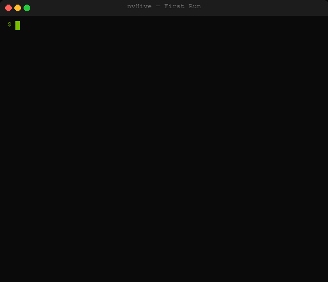
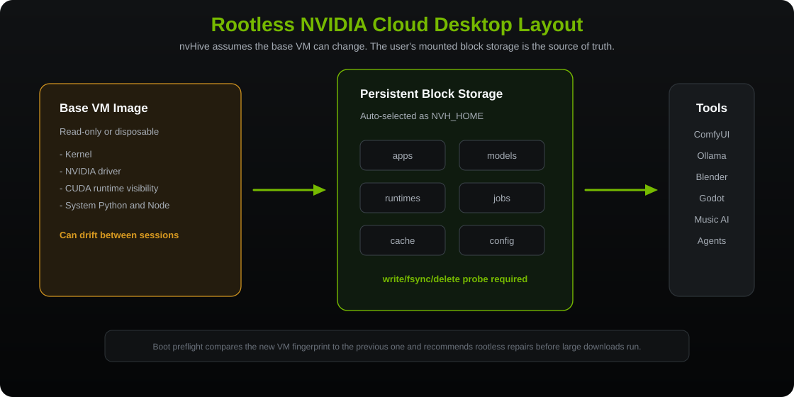
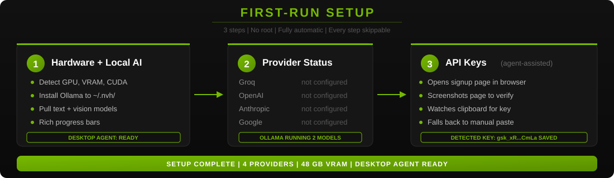
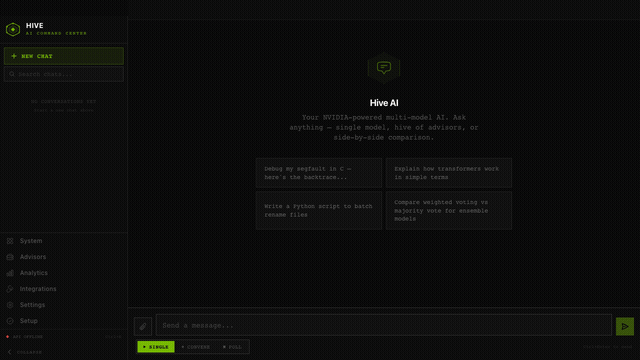
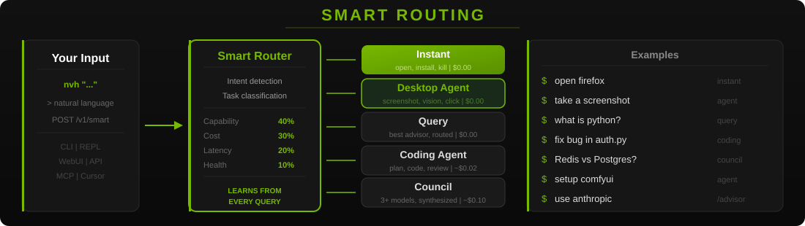
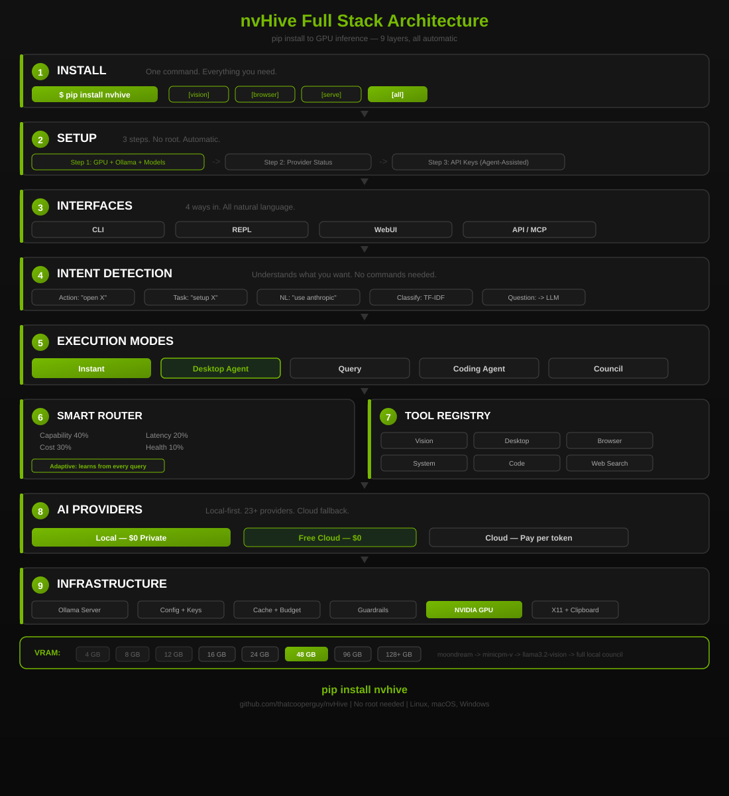

# nvHive

**A rootless NVIDIA AI lab for students, creators, agents, ComfyUI, and local models.**

   

nvHive turns a fresh cloud Linux GPU desktop into a ready-to-use AI workstation
without `sudo`: it finds persistent storage, installs into user-owned paths,
opens a setup wizard, recommends models for the detected GPU, and gives students
one-click paths for local LLMs, ComfyUI, agents, creative tools, game-dev tools,
and music production.

What you get on the happy path:

- A desktop launcher and WebUI setup wizard.
- Persistent `NVH_HOME` storage for models, ComfyUI, apps, logs, jobs, and config.
- GPU-aware model recommendations and disk estimates.
- Mission cards for AI Starter, Graphics Creator, Game Dev, Music Producer, and Agent Builder.
- Self-healing checks for storage, Python, Node, CUDA, drivers, boot drift, and install receipts.
- Redacted error reports with request IDs when something needs debugging.

Release status: CI is green across Linux, Windows, and macOS. nvHive should be
treated as a production candidate until the
[target NVIDIA Linux VM checklist](docs/PRODUCTION_READINESS.md) passes on the
actual no-root GPU desktop.

<p align="center">
  
</p>

---

## Install

Start with the Linux GPU desktop path if you are on a cloud workstation or
GeForce NOW-style session. Other install paths are below for existing Python
environments, local laptops, and single-file binary installs. No Docker, no
container runtime, and no root access are required for nvHive itself.

For cloud desktops, large downloads should live on the persistent block-backed
mount, not the read-only OS disk. The launcher finds the best candidate
automatically. If you already know the mount path, set `NVH_HOME` first:

```bash
export NVH_HOME=/mnt/persist/nvhive
```

### Recommended - Launch a Linux GPU desktop lab

This is the easiest path for cloud Linux GPU sessions where only a mounted file
volume survives reconnects:

```bash
curl -sSL https://raw.githubusercontent.com/thatcooperguy/nvHive/main/start-linux.sh | bash
```

The launcher auto-detects a likely persistent block-backed mount, sets
`NVH_HOME`, installs nvHive rootlessly if needed, creates the desktop launcher,
starts the API/WebUI, and opens the setup wizard. If Python is missing, set
`NVH_USE_BINARY=1` and the same launcher downloads the single-file Linux binary
instead of creating a venv.

```bash
curl -sSL https://raw.githubusercontent.com/thatcooperguy/nvHive/main/start-linux.sh | NVH_USE_BINARY=1 bash
```

### General Linux installer

```bash
curl -sSL https://raw.githubusercontent.com/thatcooperguy/nvHive/main/install.sh | bash
```

Works on any Linux box with no root. Installs to `NVH_HOME` when set, otherwise `~/.nvh/` for new installs, uses Python `venv` + `pip` by default, offers a rootless micromamba fallback only when the cloud image needs it, pulls Ollama if you have an NVIDIA GPU, and writes a sensible default config.

If `NVH_HOME` is not set, the installer now checks common persistent mount roots such as `/mnt`, `/media/$USER`, `/workspace`, `/data`, `/persistent`, and `/storage` before falling back to `~/.nvh`.

Windows: `iwr -useb https://raw.githubusercontent.com/thatcooperguy/nvHive/main/install.ps1 | iex`
macOS: `curl -sSL https://raw.githubusercontent.com/thatcooperguy/nvHive/main/install-mac.sh | bash`

### Single-file binary (no Python needed)

Fully standalone. No Python install, no pip, no venv. Download the asset, make it executable, and run `nvh workstation --launch`. Click your OS:

<p align="center">
  <a href="https://github.com/thatcooperguy/nvHive/releases/latest/download/nvh-linux-x86_64">
    
  </a>
  &nbsp;
  <a href="https://github.com/thatcooperguy/nvHive/releases/latest/download/nvh-macos-arm64">
    
  </a>
  &nbsp;
  <a href="https://github.com/thatcooperguy/nvHive/releases/latest/download/nvh-windows-x86_64.exe">
    
  </a>
</p>

Linux terminal path:

```bash
mkdir -p "$HOME/.local/bin"
curl -fL https://github.com/thatcooperguy/nvHive/releases/latest/download/nvh-linux-x86_64 -o "$HOME/.local/bin/nvh"
chmod +x "$HOME/.local/bin/nvh"
NVH_HOME=/mnt/persist/nvhive "$HOME/.local/bin/nvh" workstation --launch -y
```

On Linux/macOS after a browser download:
`chmod +x nvh-* && NVH_HOME=/mnt/persist/nvhive ./nvh-* workstation --launch -y`.
Full asset list (wheel, sdist, checksums) lives on the
[Releases page](https://github.com/thatcooperguy/nvHive/releases/latest).

### pip from PyPI (for existing Python environments)

```bash
pip install nvhive              # core
pip install "nvhive[vision]"    # + desktop agent (screenshot, click, type)
pip install "nvhive[browser]"   # + headless browser (playwright)
pip install "nvhive[all]"       # everything
```

`pip install` installs the Python package only. For large local models,
ComfyUI, and Studio packs, launch the workstation with a persistent `NVH_HOME`
so assets survive reconnects.

### First run

```bash
nvh                              # guided setup: GPU detect, provider keys, local model pulls
nvh workstation --all -y         # Linux GPU desktop: launcher + WebUI + ComfyUI + studio packs
nvh webui                        # open the dashboard and setup wizard
nvh "your question"              # just ask - nvHive figures out the rest
```

For a fresh Linux cloud desktop where only a mounted file volume persists,
choose that mount before installing large local assets:

```bash
export NVH_HOME=/mnt/persist/nvhive
curl -sSL https://raw.githubusercontent.com/thatcooperguy/nvHive/main/install.sh | bash
source "$NVH_HOME/nvh-env.sh"
nvh workstation --home-dir "$NVH_HOME" --all -y
```

`nvh workstation --all -y` creates a desktop launcher, starts the WebUI, prepares rootless local model tooling, installs ComfyUI with nvHive starter workflow examples, and adds the beginner AI Starter packs. Creative, game, Claw, and music missions stay one click away in the WebUI or can be installed directly with `nvh studio --install creative|game|claw|music -y`.

Use packs directly when you want a specific no-root lab:

```bash
nvh studio --list
nvh studio --models
nvh studio --install-models recommended -y
nvh studio --install llms -y
nvh studio --install agents -y
nvh studio --install claw -y                  # OpenClaw + NemoClaw when Docker/OpenShell is usable
nvh studio --install comfy -y
nvh studio --install game -y
nvh studio --install creative -y                # Blender LTS + game/asset workspace
nvh studio --install music -y                   # ACE-Step, Demucs, WhisperX, Audacity/LMMS AppImages
nvh studio --install python-runtime-fallback -y  # optional rescue pack, not the default path
```

### Pick Your Mission

The setup wizard starts with one simple question: **what do you want to make?**
Pick a mission and nvWizard handles storage, GPU checks, Python/Node runtime
checks, model recommendations, rootless installers, and background jobs.

The wizard does six things before heavy installs:

1. Finds the best user-writable persistent storage path.
2. Checks GPU, driver, CUDA, VRAM, Python, Node, and npm health.
3. Recommends local models that fit the detected hardware and disk.
4. Installs selected tools into `NVH_HOME` without root.
5. Tracks long downloads as resumable jobs with logs and receipts.
6. Offers **Fix My Setup** and **Copy Error Report** when something breaks.

| Mission | What it sets up |
| --- | --- |
| AI Starter | Local chat and coding models, Ollama, GitHub helper, and a local agent helper |
| Graphics Creator Studio | ComfyUI, Blender, image/video workflow examples, and model download plans |
| Game Dev Lab | Godot helpers, Blender assets, GitHub, Linux game tooling, and Unity/Unreal guidance |
| Music Producer Studio | AI music generation, stem splitting, transcription, audio apps, and notebooks |
| Agent Builder | OpenClaw by default, with NemoClaw unlocked only when Docker already works without sudo |

Beginner Mode shows one recommended action, a **Fix My Setup** repair path, and
mission cards. Advanced Details stays available for storage, driver, CUDA,
Python, Node, logs, receipts, boot drift, and release-readiness diagnostics.

ComfyUI, AI Studio packs, and local model downloads run as persistent jobs under
`$NVH_HOME/jobs`, so setup progress survives browser refreshes and cloud desktop
reconnects. The model picker shows GPU-fit badges, disk estimates, installed
status, and a selected download queue.

When the VM image changes between sessions, nvWizard compares the new boot
fingerprint with `$NVH_HOME/config/boot-preflight.json` and recommends rootless
repairs before launching large installs. If something still fails, **Copy Error
Report** creates a redacted report with request IDs and log locations. See
[Production Readiness](docs/PRODUCTION_READINESS.md) for the release gates and
target NVIDIA Linux VM acceptance checklist.

If setup gets stuck:

```bash
nvh webui                                      # reopen the wizard
nvh doctor --storage --home-dir "$NVH_HOME"   # verify the persistent mount
nvh doctor --fix                              # try safe local repairs
tail -n 80 "$NVH_HOME/logs/nvhive.log"        # inspect rootless logs
```

When the local API is running, Advanced Details can copy the same redacted report
from the UI, or you can call `GET /v1/setup/diagnostics` directly.

<p align="center">
  
</p>

On first run, `nvh` launches a guided setup helper for GPU detection,
provider keys, local model pulls, and rootless app installs. Works immediately
with local models when available. Every advanced step is skippable. Run
`nvh setup` anytime to reconfigure.

<p align="center">
  
</p>

### WebUI

`nvh webui` launches the local dashboard at `localhost:3000`: setup wizard,
chat, council mode, advisor status, analytics, and system health. First run
installs frontend dependencies under persistent `NVH_HOME`; later launches use
the production server for faster startup. Use `nvh webui --dev` only when
editing the frontend.

<p align="center">
  
</p>

**GPU tier model recommendations:**

| VRAM | Text Model | Vision Model | Behavior |
|------|-----------|-------------|----------|
| 0 GB (no GPU) | Cloud only | Cloud fallback | Free tiers first (Groq, LLM7, GitHub) |
| 4-8 GB | `nemotron-mini` | `moondream` | Basic local + desktop agent |
| 12-16 GB | `qwen2.5-coder:7b` | `minicpm-v` | Coding + vision local |
| 24 GB | `gemma2:27b` | `llama3.2-vision` | Strong text + best vision |
| 48 GB | `llama3.3:70b` | `llama3.2-vision` | Full power local |
| 96+ GB | Multiple 70B models | `llama3.2-vision` | Full local council, $0 |

Setup auto-detects your VRAM and recommends models that fit concurrently. No root/sudo needed for nvHive packs: tools install under `NVH_HOME` (`bin`, `models`, `runtimes`, `apps`, `webui`, `studio`, `comfyui`, `cache`, and `config`). [Full GPU guide](docs/GPU_DETECTION.md)

---

## Why nvHive

**Council scored 68% higher than a single model — at $0 cost.** Three free providers running in parallel outperformed a single model on accuracy, completeness, and coherence. [Benchmark details below.](#benchmark-results)

- **Smart team assembly.** nvHive generates expert agents for your question and matches each to the best LLM for their specialty — a "Security Engineer" agent routes to a security-strong provider, a "Database Expert" to one suited for database queries.
- **Automatic orchestration.** Coding tasks get a planner + coder + reviewer. Complex questions get a council. Simple questions get the fastest advisor. All automatic.
- **Scales with what you have.** 1 provider → single-model answers. 3+ providers → council on complex questions. Local GPU → free inference alongside cloud. DGX Spark → three 70B models in parallel, fully local.
- **4-layer safety guardrails.** Command blocklist, filesystem boundary enforcement, secrets redaction, and resource limits.

<p align="center">
  
</p>

---

## Architecture

<p align="center">
  
</p>

9 layers from `pip install` to GPU inference — install, setup, 4 user interfaces, intent detection, 5 execution modes, smart routing, tool registry, 23+ AI providers, and the hardware stack. Local-first with cloud fallback. [Architecture docs](docs/ARCHITECTURE.md)

---

## Features

### Desktop Agent

AI that sees your screen, controls mouse/keyboard, installs software, and navigates browsers — powered by local vision models.

```bash
nvh "take a screenshot and describe my desktop"
nvh "setup comfyui"                    # agent: git clone → pip install → launch → verify
nvh "open firefox and go to github.com"
```

Vision pipeline: screenshot → local vision model (llama3.2-vision / minicpm-v) → coordinate estimation → action → verify. Falls back to cloud vision if no local model. Works on Linux (X11), macOS, and Windows. [Desktop agent docs](docs/LINUX_DESKTOP.md)

### Agentic Coding

Multi-model coding agent with dynamic expert referral, iterative QA, parallel execution, and vision/browser tools.

```bash
nvh agent "Fix the streaming timeout bug in council.py"
nvh agent "Add unit tests for auth" --dir ./myproject
nvh agent "Build the notification service" --sandbox     # Docker-isolated
nvh review                     # multi-model code review
nvh test-gen nvh/core/council.py     # AI test generation
```

Key capabilities: dynamic expert referral, iterative QA refinement, parallel pipeline, Docker sandbox, execution checkpoints with rollback, LLM drift detection, multi-repo workspaces, and VS Code extension. Scales from no-GPU (fully cloud) to DGX Spark (3 local 70B models). [Agentic coding docs](docs/TOOLS.md)

### Council Mode

Run the same query through multiple providers in parallel, then synthesize. Expert personas generated per query, each assigned to a different model. Responses analyzed for agreement, synthesized by a non-member provider with a confidence score.

```bash
nvh convene "Should we use Redis or Postgres for sessions?"   # 3 models → synthesis
nvh throwdown "Review this architecture for scalability"      # 3-pass deep analysis with critique
```

Different models have different blind spots — council surfaces all perspectives. Council with 3 free providers costs $0. [Council docs](docs/COUNCIL.md)

### Smart Routing

Each request is scored across capability (40%), cost (30%), latency (20%), and health (10%), then routed to the highest-scoring provider. Routing improves over time — after 20 queries per provider, it's fully data-driven.

```bash
nvh ask --escalate "Design a distributed lock manager"    # try free first, upgrade if uncertain
nvh ask --verify "Is eval() safe in Python?"              # cross-model verification
nvh routing-stats    # see learned vs static scores
nvh health           # provider resilience dashboard
```

Local-first with NVIDIA GPUs: simple queries route to your GPU via Ollama — no cloud, no cost, no data leaving your machine. `--prefer-nvidia` gives a 1.3x routing bonus to NVIDIA hardware. [Routing docs](docs/ARCHITECTURE.md)

---

## Providers

**23 providers. 63 models. 25 free — no credit card required.**

| Tier | Providers | Rate Limits |
|------|-----------|-------------|
| **Free (no signup)** | Ollama (local), LLM7 | Unlimited / 30 RPM |
| **Free (email signup)** | Groq, GitHub Models, Cerebras, SambaNova, Cohere, AI21, SiliconFlow, HuggingFace | 15-30 RPM |
| **Free (account)** | Google Gemini, Mistral, NVIDIA NIM | 15-1000 RPM |
| **Paid** | OpenAI, Anthropic, DeepSeek, Fireworks, Together, OpenRouter, Grok | Pay per token |

[Full provider guide](docs/PROVIDERS.md)

---

## Integrations

nvHive exposes a CLI (`nvh`), web dashboard (`nvh webui`), Python SDK (`import nvh`), MCP server for Claude Code, and OpenAI/Anthropic-compatible API proxies.

```python
import nvh

response = await nvh.complete([{"role": "user", "content": "Explain quicksort"}])
result = await nvh.convene("Architecture review", cabinet="engineering")
```

| Integration | Setup |
|-------------|-------|
| Anthropic SDK | `ANTHROPIC_BASE_URL=http://localhost:8000/v1/anthropic` |
| OpenAI SDK | `OPENAI_BASE_URL=http://localhost:8000/v1/proxy` |
| Claude Code | `claude mcp add nvhive -- python -m nvh.mcp_server` |
| NemoClaw | `nvh nemoclaw --start` — [NemoClaw docs](docs/NEMOCLAW.md) |

[SDK & API reference](docs/SDK_API.md) | [Claude Code integration](docs/CLAUDE_CODE_INTEGRATION.md) | [OpenClaw migration](docs/OPENCLAW_MIGRATION.md)

---

## Benchmark Results

Real data from NVIDIA DGX Spark (GB10, 120GB). 16 prompts across code generation, debugging, reasoning, math, creative writing, and Q&A. Judged by OpenAI with ground truth verification.

| Mode | Accuracy | Completeness | Coherence | **Overall** | Cost |
|------|----------|-------------|-----------|---------|------|
| Single Model (Nemotron Super) | 5.5 | 5.7 | 5.0 | **5.1** | $0.00 |
| **Council (Ollama + Groq + Google)** | **9.0** | **8.0** | **9.0** | **8.6** | **$0.00** |

```bash
nvh bench              # GPU speed (tokens/sec)
nvh bench -q           # speed + quality comparison
nvh health             # provider resilience
```

Results vary by hardware and workload — run `nvh bench` to measure on your setup.

---

## Core Commands

| Command | What It Does |
|---------|-------------|
| `nvh "question"` | Smart route to best available model |
| `nvh convene "question"` | Council consensus (3+ models) |
| `nvh throwdown "question"` | Three-pass deep analysis with critique |
| `nvh agent "task"` | Agentic coding with expert referral + QA |
| `nvh review` | Multi-model code review |
| `nvh test-gen file.py` | AI test generation with verification |
| `nvh safe "question"` | Local only — nothing leaves your machine |
| `nvh serve` | Start API server (OpenAI + Anthropic proxy) |
| `nvh webui` | Launch web dashboard |
| `nvh health` | Provider resilience dashboard |
| `nvh bench` | GPU speed test (tokens/sec) |
| `nvh setup` | Interactive provider setup |
| `nvh doctor` | Full diagnostic dump |

[Full command reference](docs/COMMANDS.md) (50+ commands)

---

## Documentation

| Guide | Description |
|-------|-------------|
| [Student GPU Cloud / Linux Desktop](docs/LINUX_DESKTOP.md) | No-root NVIDIA Linux workstation and ComfyUI guide |
| [Production Readiness](docs/PRODUCTION_READINESS.md) | Release gates and target NVIDIA Linux VM acceptance checklist |
| [Deploy Without Root](docs/DEPLOY_NO_ROOT.md) | No-root install on servers |
| [Windows Troubleshooting](docs/TROUBLESHOOTING_WINDOWS.md) | Encoding, segfaults, port issues |
| [Getting Started](docs/GETTING_STARTED.md) | General CLI/provider setup after the no-root workstation path |
| [Commands](docs/COMMANDS.md) | Full CLI reference (50+ commands) |
| [Providers](docs/PROVIDERS.md) | 23 providers, rate limits, free tiers |
| [Council System](docs/COUNCIL.md) | Multi-LLM consensus with confidence scoring |
| [Architecture](docs/ARCHITECTURE.md) | System design and adaptive routing |
| [GPU Detection](docs/GPU_DETECTION.md) | Auto-detection, model selection, OOM protection |
| [SDK & API](docs/SDK_API.md) | Python SDK, REST API, proxies |
| [Agent Tools](docs/TOOLS.md) | Agent tools and capabilities |
| [Configuration](docs/CONFIGURATION.md) | Configuration reference |
| [Web UI](docs/WEBUI.md) | Web dashboard |
| [Releasing](docs/RELEASING.md) | Release runbook |

---

## Important Notes

- **Data Privacy**: Cloud providers transmit queries to third-party APIs subject to each provider's privacy policy. Use `nvh safe` or `--prefer-nvidia` to keep inference local.
- **AI Accuracy**: AI-generated outputs may contain errors. Review agent-modified files before committing to production.
- **Security**: Safety guardrails use pattern-matching heuristics. For sensitive environments, use `--sandbox` with Docker isolation.
- **Benchmarks**: Results measured on NVIDIA DGX Spark reference hardware. Results vary by hardware, provider, and workload.

## License

MIT License. See [LICENSE](LICENSE) for details.
