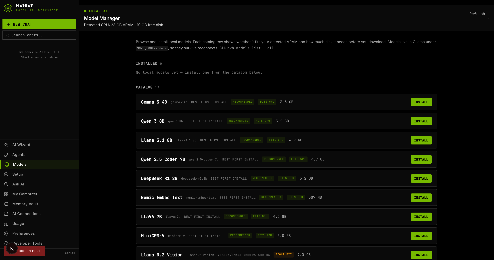
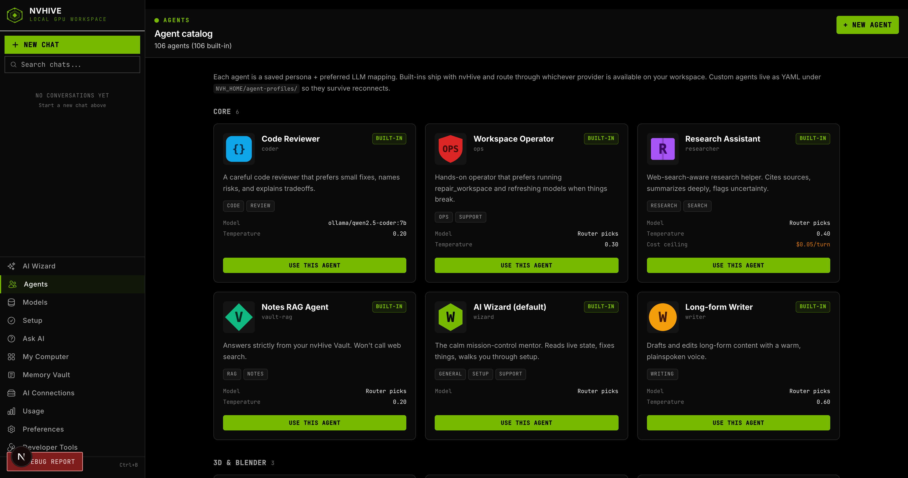

<div align="center">

# nvHive

**One curl command turns a rented Linux GPU desktop into a working AI lab.**

No root. No Docker. Survives reconnects.

[](https://pypi.org/project/nvhive/)
[](LICENSE)
[](https://github.com/thatcooperguy/nvHive/actions/workflows/ci.yml)

</div>

```bash
curl -sSL https://raw.githubusercontent.com/thatcooperguy/nvHive/main/install.sh | bash
```

Works on GeForce NOW, RunPod, Lambda, Vast — anywhere you can open a terminal on an NVIDIA machine. A few minutes later your browser opens on a dashboard where everything already works:

- **A local LLM picked for your GPU's VRAM** — chat and image understanding with nothing leaving the machine
- **An AI Wizard that knows your workspace** — reads live GPU/service state, fixes problems, RAGs over your files, searches the web
- **A router across 23 providers** — free tiers first when you have no keys, your GPU first when you do
- **Storage that survives resets** — models, chats, and config live on the persistent volume

The browser only opens after every service passes a health check — including a real end-to-end test where the Wizard answers a message. You pay for GPU time, not debugging time.



## What's inside

**Model Manager.** nvHive detected your GPU at install, so every model in the catalog shows a *fits-your-GPU* verdict and disk size **before** you download. One-click install with live progress, or `nvh models pull gemma3:4b` from the terminal. [Guide →](docs/MODELS.md)

**AI Wizard.** A streaming, tool-using assistant grounded in live workspace state. It can refresh models, run safe repairs, ingest files you drag into chat (PDFs included), and cite web sources — showing cost and latency per response. Attach external [MCP tool servers](docs/MCP.md) and their tools join its toolset.

**100+ agents, council mode.** An Agent Library across 38 categories — coding, research, creative, GPU media, ops — each mappable to a local or cloud model. Council mode runs one question through multiple models in parallel and synthesizes the answers: `nvh convene "Redis or Postgres for session storage?"`. [Council →](docs/COUNCIL.md)



**Chat history that survives.** Conversations persist server-side, browsable and resumable from every page. Pin one and it's waiting for you after a reconnect.

**Studio packs.** Rootless one-command installs for ComfyUI, Blender, game-dev tooling, and music production: `nvh studio --install comfy -y`.

**Built for machines that disappear.** Everything lives under `NVH_HOME` on the persistent volume. Downloads run as resumable jobs. `nvh snapshot save` / `restore` moves your whole state to a brand-new VM. If your persistent mount isn't auto-detected: `export NVH_HOME=/mnt/persist/nvhive` before installing.

## Requirements

- **Linux x86_64** (primary target; Windows/macOS binaries on the [Releases page](https://github.com/thatcooperguy/nvHive/releases/latest))
- **No root, no Docker** — everything installs to user-owned paths
- **Python 3.11+**, or none at all (`NVH_USE_BINARY=1` fetches a single-file binary)
- **GPU optional** — CPU-only machines get a small local model plus cloud free tiers
- **Disk** — ~2 GB for the smallest local model; the installer shows sizes and checks free space before downloading

Already have Python? `pip install nvhive` (extras: `[vision]`, `[rag]`, `[all]`).

## If something breaks

```bash
nvh services status      # per-service health table
nvh services restart     # recycle the stack
nvh doctor               # full diagnostic
```

The dashboard's **Debug Report** button generates a redacted report (secrets stripped) you can paste straight into an issue. Logs live under `$NVH_HOME/logs/`.

## Commands

| Command | What it does |
|---|---|
| `nvh "question"` | Route to the best available model |
| `nvh safe "question"` | Local inference only — nothing leaves the machine |
| `nvh convene "question"` | Multi-model council with synthesis |
| `nvh agent "task"` | Agentic coding with review loop |
| `nvh models list --all` | Fit-ranked model catalog for your GPU |
| `nvh services start` | Verified bring-up (Ollama → API → WebUI → smoke test) |
| `nvh studio --install <pack> -y` | Rootless tool-pack install |
| `nvh snapshot save` / `restore` | Move state across ephemeral VMs |
| `nvh setup` | Configure providers and keys |

Full reference: [docs/COMMANDS.md](docs/COMMANDS.md)

## Documentation

| Guide | What's inside |
|---|---|
| [Linux GPU Desktop](docs/LINUX_DESKTOP.md) | The no-root cloud workstation path in depth |
| [Model Manager](docs/MODELS.md) | The in-app model browser and VRAM-fit logic |
| [Providers](docs/PROVIDERS.md) | All 23 providers, free tiers, rate limits |
| [MCP](docs/MCP.md) | Attach external tool servers to the Wizard |
| [Architecture](docs/ARCHITECTURE.md) | Routing, layers, system design |
| [SDK & API](docs/SDK_API.md) | Python SDK, REST API, OpenAI/Anthropic-compatible proxies |
| [Configuration](docs/CONFIGURATION.md) | Every knob, including `NVH_HOME` and install env vars |

## Notes

- Cloud providers receive the queries you route to them, under their own privacy policies. Use `nvh safe` to keep inference local.
- AI output can be wrong. Review agent-modified files before shipping them.

## License

**PolyForm Noncommercial 1.0.0** — use, modify, and share nvHive freely for any noncommercial purpose. **Selling this code or using it commercially is not permitted.** See [LICENSE](LICENSE) and [NOTICE](NOTICE.md). Versions 0.40.0 and earlier were released under MIT and remain MIT.

The license does not grant rights to the nvHive name or logos; forks should use distinct names. See [TRADEMARKS](TRADEMARKS.md).
