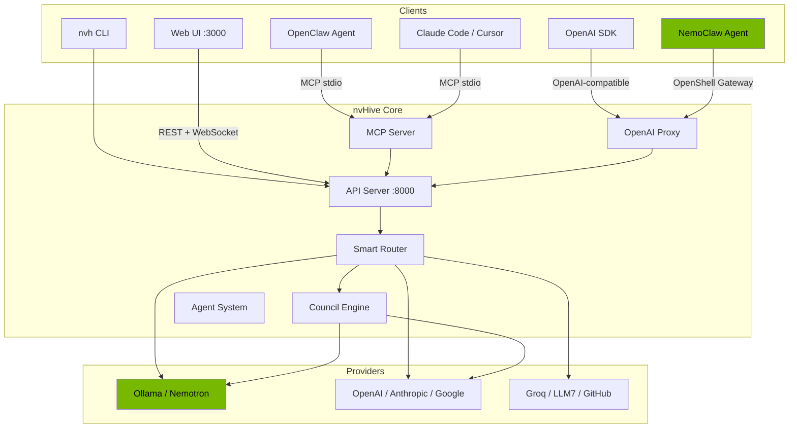

# Architecture

System design and data flow for nvHive.

## Overview

```
nvh CLI / Web UI / SDK
  │
  ├── Action Detector ────────► Direct execution (install, open, find)
  │
  ├── Smart Router
  │     ├── Task classifier (code, writing, research, math, general)
  │     ├── Advisor scorer (relevance, cost, speed, privacy)
  │     └── Model selector (GPU VRAM, provider availability)
  │
  ├── Providers (22)
  │     ├── Local: Ollama (Nemotron, CodeLlama, Llama3)
  │     ├── Cloud: OpenAI, Anthropic, Google, Groq, ...
  │     └── Free: LLM7, GitHub Models, NVIDIA NIM, ...
  │
  ├── Agent System
  │     ├── Auto-generation from query analysis
  │     └── 12 pre-built cabinets (22 expert personas)
  │
  ├── Tool System (27 tools, 18 safe / 9 confirm)
  │
  ├── Integrations
  │     ├── NemoClaw ─── OpenAI-compatible inference provider
  │     ├── OpenClaw ─── MCP tool server
  │     ├── Claude Code / Cursor ─── MCP tool server
  │     └── Auto-detect + one-click setup (nvh integrate)
  │
  └── SDK + OpenAI-compatible API + MCP server
```

## Full Architecture Diagram



## Key Components

| Component | File | Description |
|-----------|------|-------------|
| Engine | `nvh/core/engine.py` | Main orchestration engine |
| Router | `nvh/core/router.py` | Task classification and provider scoring |
| Council | `nvh/core/council.py` | Parallel multi-LLM dispatch and synthesis |
| Orchestrator | `nvh/core/orchestrator.py` | Local LLM intelligence (routing, eval, compression) |
| Agent Loop | `nvh/core/agent_loop.py` | Agentic task execution with tool calling |
| Providers | `nvh/providers/` | 22 LLM provider adapters via LiteLLM |
| API Server | `nvh/api/server.py` | FastAPI REST + WebSocket server |
| Proxy | `nvh/api/proxy.py` | OpenAI-compatible API proxy |
| MCP Server | `nvh/mcp_server.py` | Model Context Protocol tool server |
| CLI | `nvh/cli/main.py` | Typer CLI entry point |
| WebUI | `web/` | Next.js 14 + Tailwind dashboard |

---

Back to [README](../README.md)
