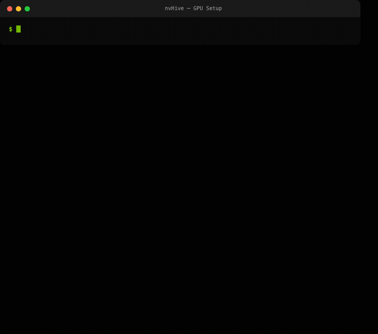
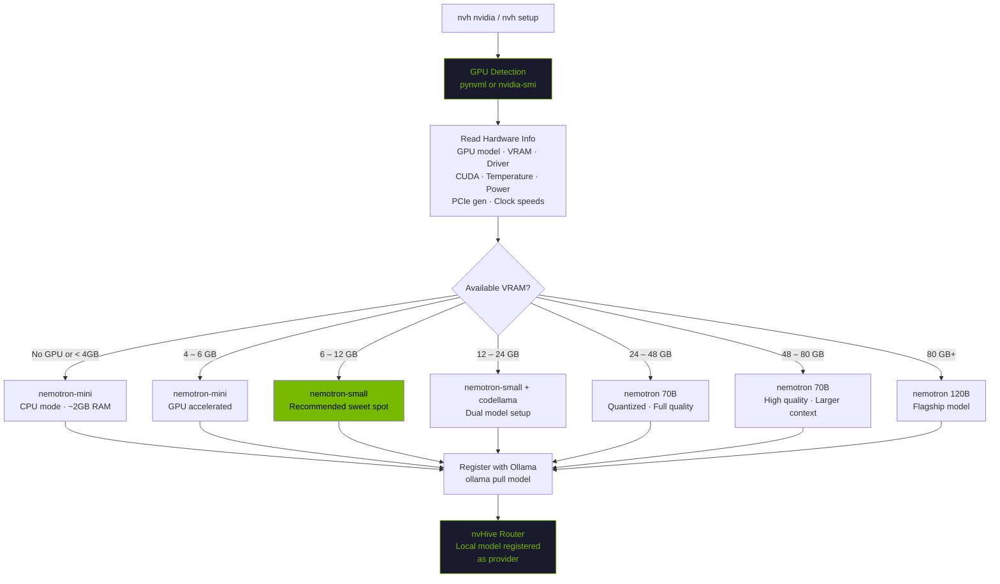

# GPU Detection & Model Selection

nvHive auto-detects your GPU hardware and selects the optimal Nemotron model for local inference. No manual configuration needed.

<p align="center">
  
</p>

## How It Works



## Model Recommendations by VRAM

| VRAM | Model | Size | Use Case |
|------|-------|------|----------|
| No GPU / < 4 GB | `nemotron-mini` | ~2 GB | CPU mode — slow but functional |
| 4 – 6 GB | `nemotron-mini` | ~2 GB | GPU accelerated, good for simple queries |
| **6 – 12 GB** | **`nemotron-small`** | **~5 GB** | **Recommended sweet spot — quality + speed** |
| 12 – 24 GB | `nemotron-small` + `codellama` | ~9 GB | Dual model — general + code specialist |
| 24 – 48 GB | `nemotron` (70B) | ~40 GB | Full model, quantized |
| 48 – 80 GB | `nemotron` (70B) | ~40 GB | Full model, higher quality quantization |
| 80 GB+ | `nemotron:120b` | ~70 GB | Flagship — maximum quality |

Multi-GPU systems: Ollama automatically distributes layers across all detected GPUs.

## GPU Detection Details

nvHive uses **pynvml** (NVIDIA Management Library Python bindings) for direct GPU access. Falls back to parsing `nvidia-smi` output if pynvml is not installed.

### What pynvml reads:
- GPU model name (e.g. "NVIDIA GeForce RTX 4090")
- Total and available VRAM
- Driver version and CUDA version
- GPU utilization percentage
- Temperature (Celsius)
- Power draw and power limit (watts)
- GPU and memory clock speeds (MHz)
- PCIe generation and width
- Running processes using the GPU

### What nvidia-smi reads (fallback):
- GPU model name
- Total and used VRAM
- Driver version
- GPU utilization

```bash
# Install pynvml for full detection (optional — nvidia-smi fallback works)
pip install nvidia-ml-py3

# See what nvHive detects
nvh nvidia
```

## Commands

```bash
# Full GPU + inference stack status
nvh nvidia

# Benchmark your GPU (tokens/sec)
nvh bench

# Model recommendations based on your hardware
nvh test    # includes GPU detection + model recommendations

# Force all queries to local GPU
nvh safe "your question"

# Routing bonus for NVIDIA hardware
nvh --prefer-nvidia "your question"

# Or set permanently
nvh config set defaults.prefer_nvidia true
```

## OOM Protection

nvHive checks if a model fits in your GPU VRAM before loading:

- **Fits in VRAM**: Full GPU acceleration, best performance
- **Partially fits**: GPU + CPU offload (slower layers on RAM)
- **Doesn't fit**: Warning with smaller model recommendation

```bash
# Check if a specific model will fit
nvh bench --model nemotron    # shows VRAM usage during benchmark
```

## How Routing Uses GPU Info

Once Ollama is running with a Nemotron model, nvHive's router:

1. Registers the local model as a provider
2. Scores it on capability per task type (conversation, Q&A, code, etc.)
3. Routes simple queries locally — free, private, no latency
4. Escalates complex queries to cloud when local quality isn't sufficient
5. The **adaptive learning loop** measures the local model's actual quality on your hardware and adjusts routing thresholds over time

With `--prefer-nvidia`, local NVIDIA providers get a 1.3x routing bonus, keeping more queries on your GPU.

## Supported GPUs

Any NVIDIA GPU with CUDA support works. Performance varies by VRAM and compute capability:

| GPU | VRAM | Expected Performance |
|-----|------|---------------------|
| RTX 3060 | 12 GB | ~55 tok/s with nemotron-small |
| RTX 3080 | 10 GB | ~75 tok/s with nemotron-small |
| RTX 3090 | 24 GB | ~90 tok/s with nemotron |
| RTX 4070 | 12 GB | ~85 tok/s with nemotron-small |
| RTX 4080 | 16 GB | ~110 tok/s with nemotron-small |
| RTX 4090 | 24 GB | ~140 tok/s with nemotron |
| A100 | 40/80 GB | ~250 tok/s with nemotron 70B |
| H100 | 80 GB | ~380 tok/s with nemotron 70B |

Run `nvh bench` to measure your actual performance. Results are compared against community baselines for your GPU model.

Apple Silicon (M1/M2/M3/M4) is also supported via Ollama's Metal backend, but without pynvml GPU detection details.
