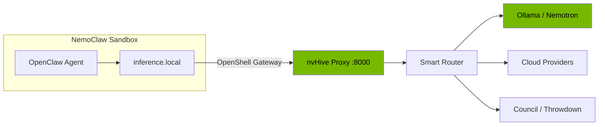

# NemoClaw Integration

nvHive integrates with [NVIDIA NemoClaw](https://github.com/NVIDIA/NemoClaw) in two ways:

1. **Inference Provider** — all agent LLM calls route through nvHive's smart router automatically
2. **MCP Tool Server** — agents can explicitly call `council()` and `throwdown()` for multi-model consensus

## Inference Provider Setup

```bash
# Setup in three commands:
nvh nemoclaw --start                     # 1. Start nvHive proxy
openshell provider create \              # 2. Register with NemoClaw
    --name nvhive --type openai \
    --credential OPENAI_API_KEY=nvhive \
    --config OPENAI_BASE_URL=http://host.openshell.internal:8000/v1/proxy
openshell inference set \                # 3. Set as default
    --provider nvhive --model auto
```

## Virtual Models

NemoClaw agents can request any virtual model:

| Model | What It Does |
|-------|-------------|
| `auto` | Smart routing — best provider for the query |
| `safe` | Local only — nothing leaves your machine |
| `council` | 3-model consensus with synthesis |
| `council:N` | N-model council (2-10 members) |
| `throwdown` | Two-pass deep analysis with critique |

## Privacy-Aware Routing

Set `x-nvhive-privacy: local-only` header to force all inference through local Ollama, integrating with NemoClaw's content sensitivity routing.

## Architecture



Run `nvh nemoclaw` for the full setup guide, or `nvh nemoclaw --test` to verify connectivity.

## MCP Tool Server Setup

In addition to inference routing, NemoClaw agents can call nvHive tools directly via MCP:

```bash
pip install "nvhive[mcp]"
nvh nemoclaw --mcp      # show full MCP setup
```

Add to your NemoClaw agent config:

```json
{
  "mcpServers": {
    "nvhive": {
      "command": "nvhive-mcp"
    }
  }
}
```

### Available MCP Tools

| Tool | What It Does |
|------|-------------|
| `ask` | Smart-routed query across 22 providers |
| `ask_safe` | Local-only query (nothing leaves machine) |
| `council` | Multi-model consensus (3-10 LLMs debate) |
| `throwdown` | Two-pass deep analysis with critique |
| `status` | Provider and GPU status |
| `list_advisors` | Available providers |
| `list_cabinets` | Expert persona presets |

### Why Both Inference + MCP?

- **Inference provider**: every agent LLM call auto-routes to the best model. The agent doesn't need to think about model selection.
- **MCP tools**: the agent can explicitly request council consensus or throwdown analysis when a decision needs multiple perspectives. This is something inference routing alone can't do — it picks one model per call, while `council()` dispatches to many.

---

Back to [README](../README.md)
