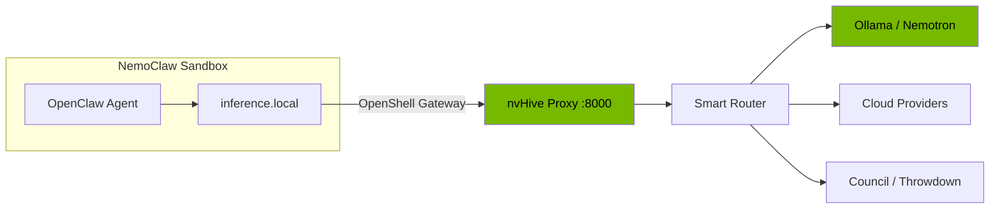

# NemoClaw Integration

nvHive works as an inference provider inside [NVIDIA NemoClaw](https://github.com/NVIDIA/NemoClaw), giving NemoClaw agents access to multi-model smart routing, council consensus, and throwdown analysis.

## Setup

```bash
# Setup in three commands:
nvh nemoclaw --start                     # 1. Start nvHive proxy
openshell provider create \              # 2. Register with NemoClaw
    --name nvhive --type openai \
    --credential OPENAI_API_KEY=nvhive \
    --config OPENAI_BASE_URL=http://host.openshell.internal:8000/v1/proxy
openshell inference set \                # 3. Set as default
    --provider nvhive --model auto
```

## Virtual Models

NemoClaw agents can request any virtual model:

| Model | What It Does |
|-------|-------------|
| `auto` | Smart routing — best provider for the query |
| `safe` | Local only — nothing leaves your machine |
| `council` | 3-model consensus with synthesis |
| `council:N` | N-model council (2-10 members) |
| `throwdown` | Two-pass deep analysis with critique |

## Privacy-Aware Routing

Set `x-nvhive-privacy: local-only` header to force all inference through local Ollama, integrating with NemoClaw's content sensitivity routing.

## Architecture



Run `nvh nemoclaw` for the full setup guide, or `nvh nemoclaw --test` to verify connectivity.

---

Back to [README](../README.md)
