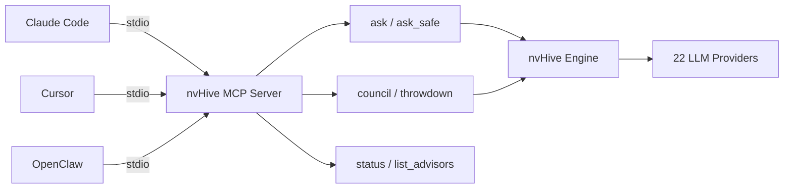

# Python SDK, OpenAI-Compatible Proxy, and MCP Server

nvHive provides multiple programmatic interfaces: a native Python SDK, an OpenAI-compatible proxy server, and an MCP server for tool-based integrations.

## Python SDK

```python
from nvh import ask, convene, poll, safe, quick

# Simple query
response = await ask("What is machine learning?")

# Specific advisor
response = await ask("Debug this code", advisor="anthropic")

# Council of experts
result = await convene("Should we use Rust?", cabinet="engineering")

# Poll all advisors
results = await poll("Write a sort function")

# Local only
response = await safe("Analyze my salary data")
```

Synchronous versions available: `ask_sync`, `convene_sync`.

## OpenAI-Compatible Proxy

Run nvHive as a drop-in backend for any tool that speaks the OpenAI API:

```bash
nvh serve --port 8000
```

Then point any OpenAI SDK client at `http://localhost:8000`:

```python
from openai import OpenAI
client = OpenAI(base_url="http://localhost:8000/v1", api_key="nvhive")
response = client.chat.completions.create(
    model="auto",  # nvHive picks the best model
    messages=[{"role": "user", "content": "Hello"}]
)
```

## MCP Server (Claude Code, Cursor, OpenClaw)

nvHive exposes its tools via the [Model Context Protocol](https://modelcontextprotocol.io/), making them available to Claude Code, Cursor, OpenClaw, and any MCP-compatible client.

```bash
# Install MCP support
pip install "nvhive[mcp]"

# Register with Claude Code
claude mcp add nvhive nvh mcp

# Or start as HTTP server for remote clients
nvh mcp -t streamable-http --port 8080
```

Tools available via MCP: `ask`, `ask_safe`, `council`, `throwdown`, `status`, `list_advisors`, `list_cabinets`.



For OpenClaw agents, generate the config:

```bash
nvh openclaw              # setup guide + auto-config
nvh openclaw --config     # creates openclaw.json with nvHive MCP config
```

---

Back to [README](../README.md)
