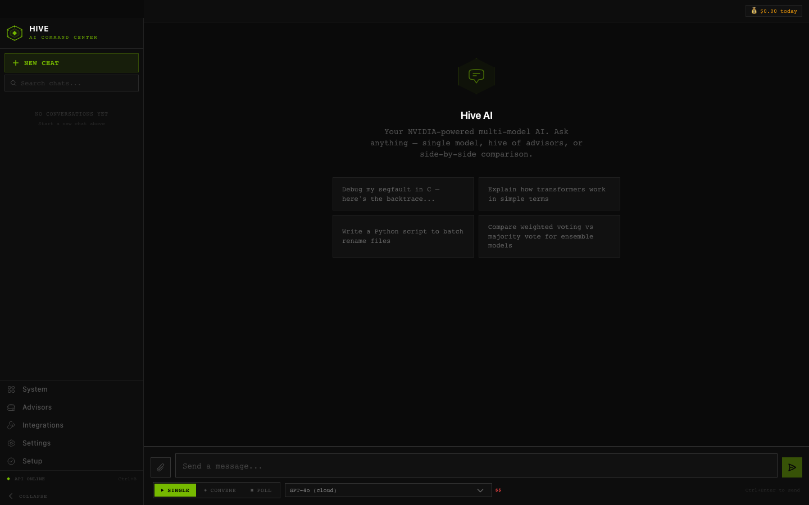
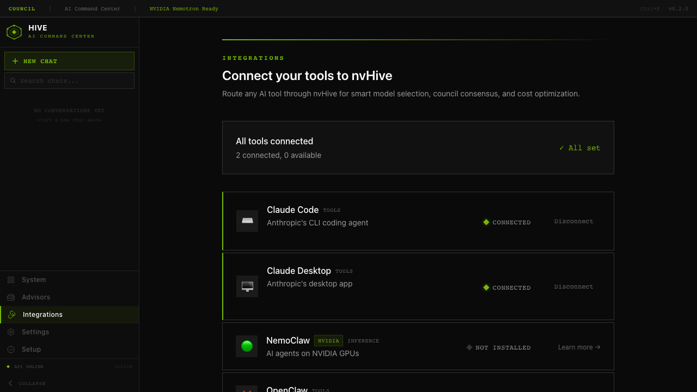
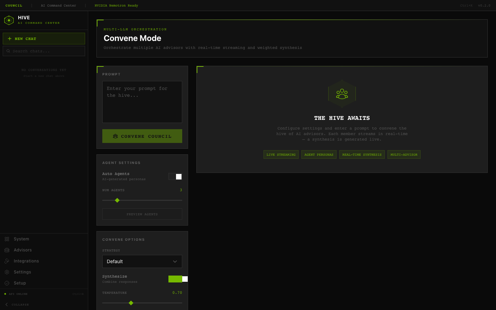
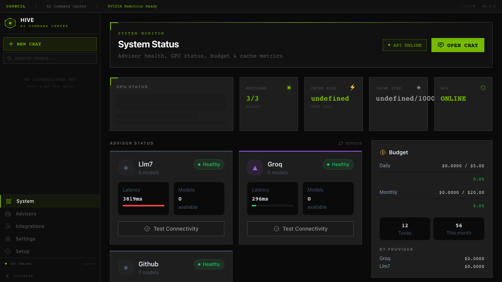
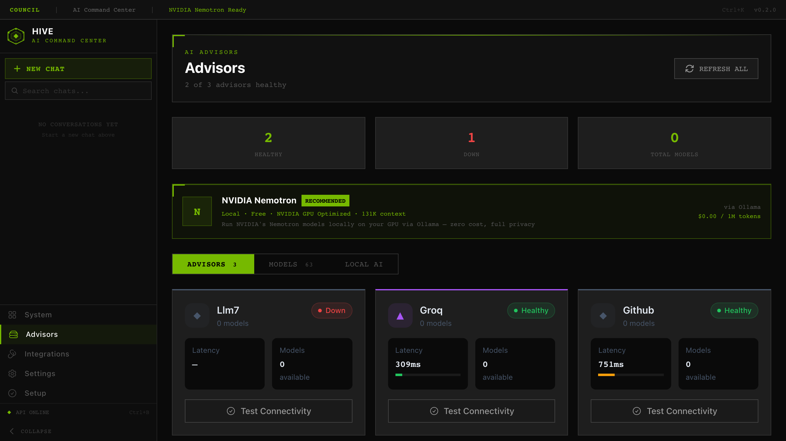
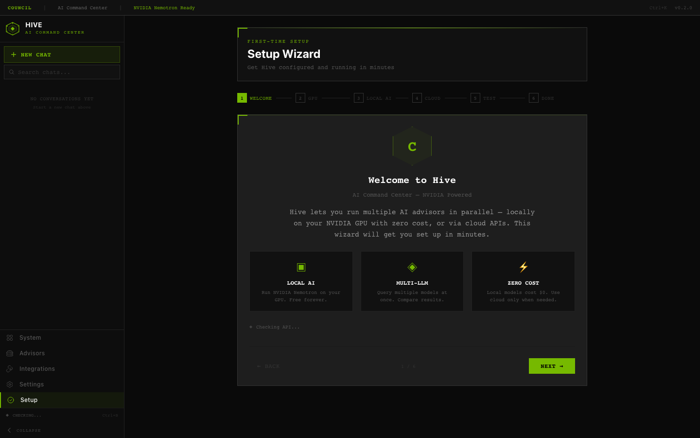
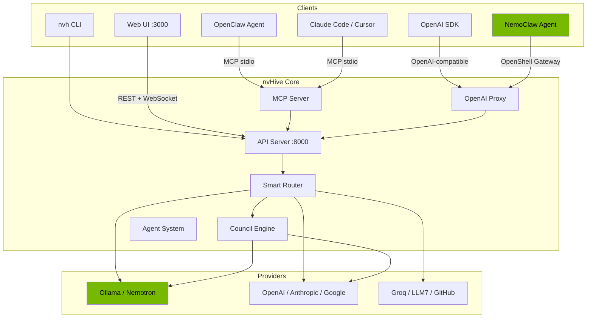

# Web Interface

nvHive includes a full web dashboard for users who prefer a visual experience over the CLI. Launch it with:

```bash
nvh webui
```

The dashboard opens at `http://localhost:3000` and connects to the nvHive API automatically.

## Pages

| Page | What It Does |
|------|-------------|
| **Chat** | Send prompts in single, council, or compare mode with streaming responses |
| **Council** | Real-time multi-LLM orchestration with live member progress and synthesis |
| **Query Builder** | Advanced query form with provider/model filters and agent presets |
| **Advisors** | Provider health status, model listings, and connectivity testing |
| **Integrations** | Auto-detect and connect NemoClaw, OpenClaw, Claude Code, Cursor |
| **System** | GPU info, cache stats, budget status, and recommendations |
| **Settings** | API URL, defaults, budget limits, theme, and council strategy |
| **Setup Wizard** | Step-by-step onboarding: GPU detection, local AI, cloud providers |

## Design

- NVIDIA-inspired dark theme with green (#76B900) accents
- Angular design language with diamond status indicators
- Command palette (Ctrl+K) for quick navigation
- Real-time streaming via SSE and WebSocket
- Responsive layout for desktop and mobile
- Keyboard shortcuts throughout (Ctrl+N, Ctrl+B, Ctrl+/)

## Screenshots

| Chat Interface | Integrations |
|:-:|:-:|
|  |  |

| Council Mode | System Dashboard |
|:-:|:-:|
|  |  |

| Advisors | Setup Wizard |
|:-:|:-:|
|  |  |

## Architecture Diagram



---

Back to [README](../README.md)
