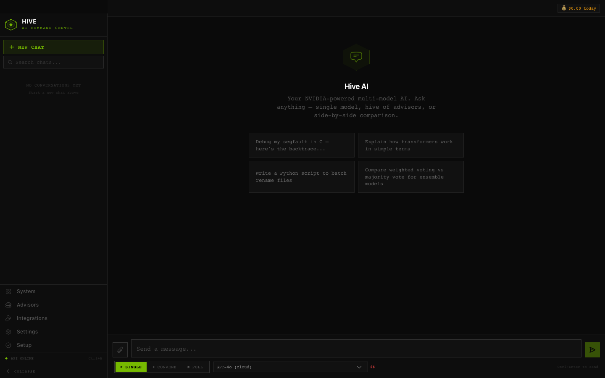
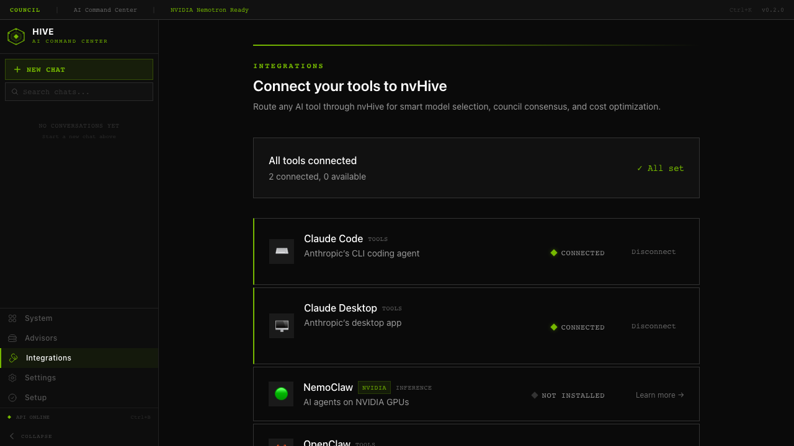
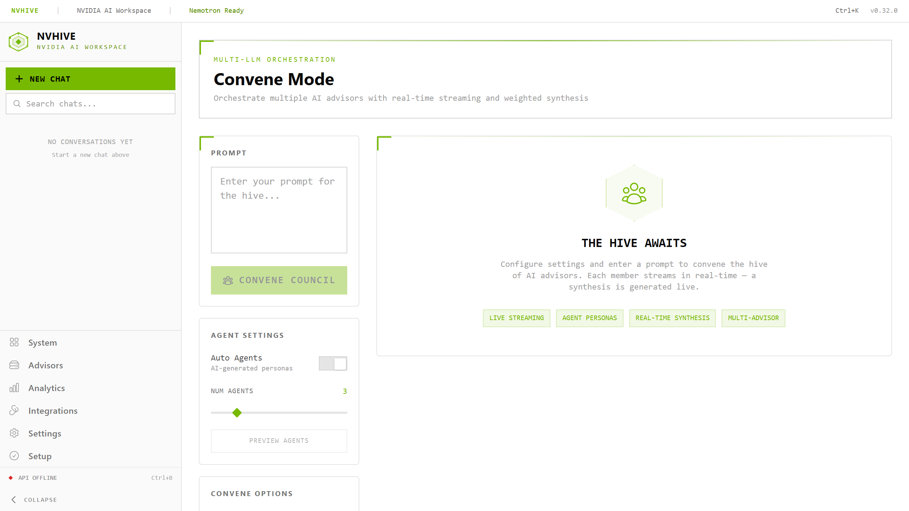
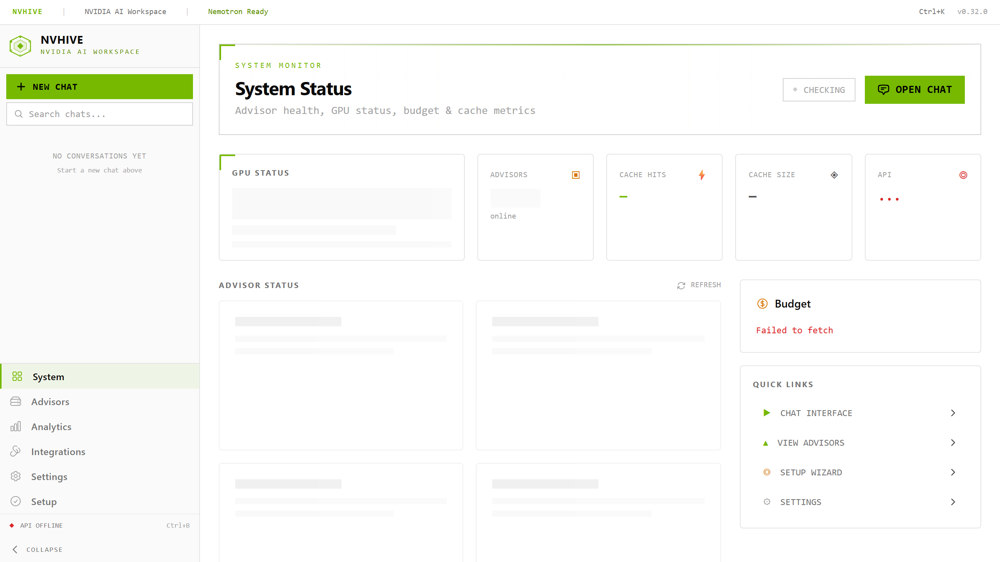
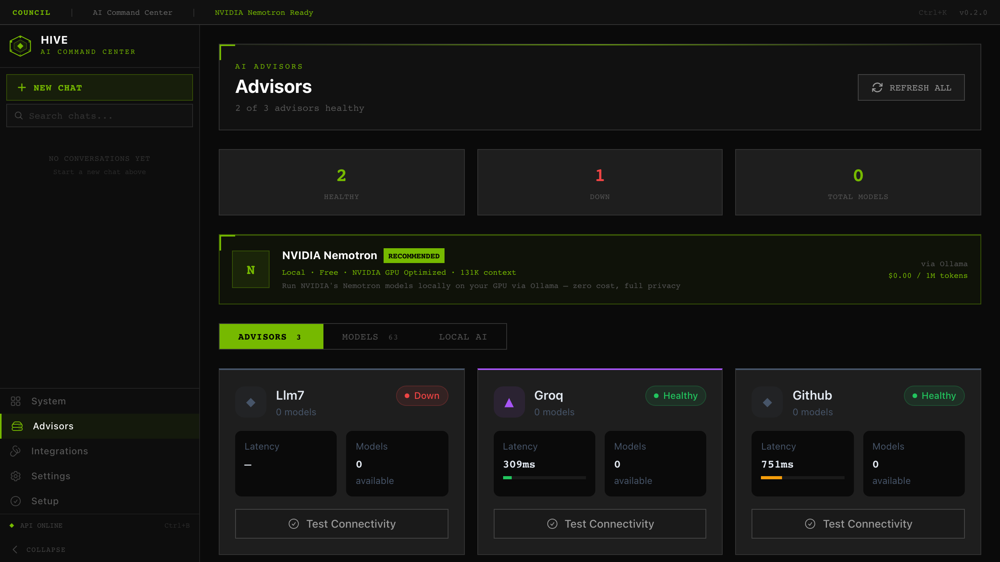
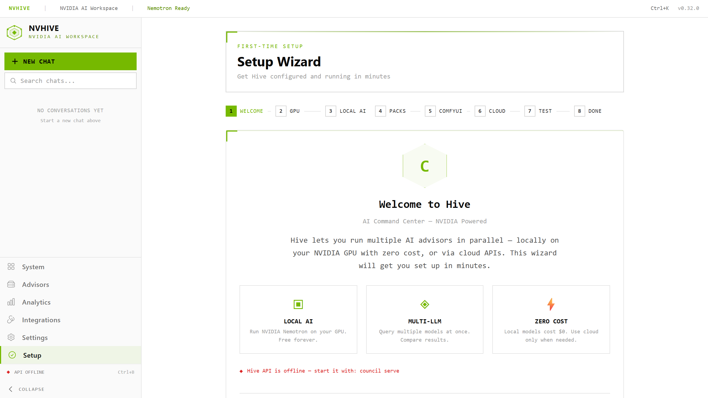
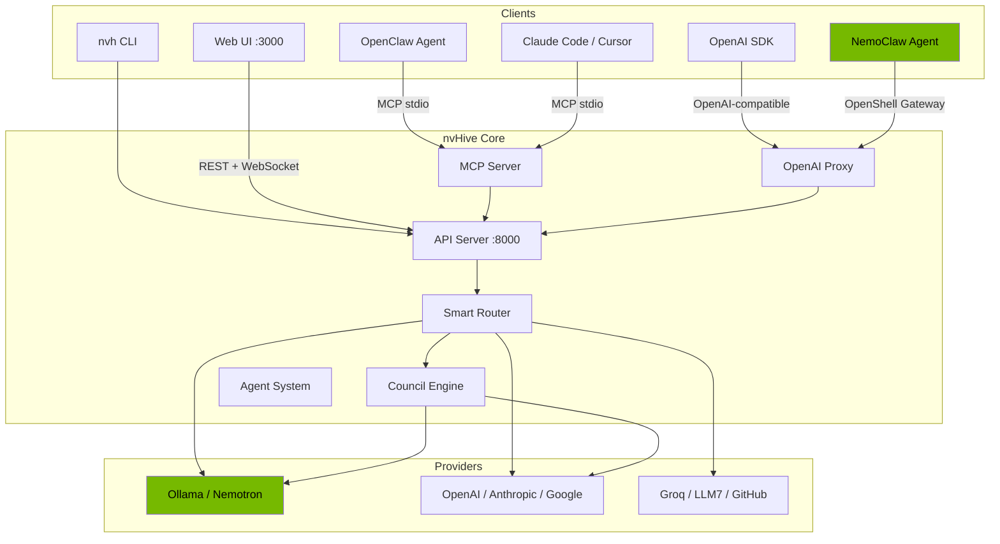

# Web Interface

nvHive includes a full web dashboard for users who prefer a visual experience over the CLI. Launch it with:

```bash
nvh webui
```

The dashboard opens at `http://localhost:3000` and connects to the nvHive API automatically.
First launch installs dependencies and builds the WebUI under persistent `NVH_HOME`.
Later launches run the optimized production server. Use `nvh webui --dev` only
when developing the frontend. Pip and binary installs can fetch the WebUI with
`git` or, when `git` is absent, a GitHub source-archive fallback. The bootstrap
tries the installed release tag first and falls back to `main` only if needed.
The API allows local WebUI fallback ports automatically, so rootless launches on
`localhost`, `127.0.0.1`, `nvhive`, or loopback IPv6 keep working when the
preferred port is already occupied.

## Pages

| Page | What It Does |
|------|-------------|
| **Chat** | Send prompts in single, council, or compare mode with streaming responses |
| **Council** | Real-time multi-LLM orchestration with live member progress and synthesis |
| **Query Builder** | Advanced query form with provider/model filters and agent presets |
| **Advisors** | Provider health status, model listings, and connectivity testing |
| **Integrations** | Auto-detect and connect NemoClaw, OpenClaw, Claude Code, Cursor |
| **System** | GPU info, cache stats, budget status, and recommendations |
| **Settings** | API URL, defaults, budget limits, theme, and council strategy |
| **Setup Wizard** | Step-by-step onboarding: GPU detection, local AI, cloud providers |

## Chat history

Past conversations live in the sidebar on every page, grouped by date
(Pinned / Today / Yesterday / Previous 7 Days / Older) with search, inline
rename, and a right-click menu (Pin, Rename, Export as Markdown, Delete).

- **Resume anywhere** — clicking a conversation reopens it on the surface
  that produced it: Wizard chats resume on `/wizard`, chat/council threads
  on the main page.
- **Wizard persistence** — every Wizard turn is saved server-side
  (SQLite at `$NVH_HOME/state/nvhive.db`), so a page reload or a
  reconnect to the same workspace picks the thread back up.
- **Pin** a conversation (right-click, or `/pin` in Wizard chat) to keep
  it at the top of the sidebar and surface it on reconnect.
- **Search across history** — the sidebar filter matches titles;
  `GET /v1/conversations/search?q=` matches full message content.
- **Two stores, one sidebar** — Wizard chats persist server-side; main-page
  single/council chats stay in this browser (localStorage) and still appear
  in the shared sidebar everywhere. Rename, pin, delete, and Export apply
  to whichever store owns the chat.

## Design

- NVIDIA-inspired dark theme with green (#76B900) accents
- Angular design language with diamond status indicators
- Command palette (Ctrl+K) for quick navigation
- Real-time streaming via SSE and WebSocket
- Responsive layout for desktop and mobile
- Keyboard shortcuts throughout (Ctrl+N, Ctrl+B, Ctrl+/)

## Screenshots

| Chat Interface | Integrations |
|:-:|:-:|
|  |  |

| Council Mode | System Dashboard |
|:-:|:-:|
|  |  |

| Advisors | Setup Wizard |
|:-:|:-:|
|  |  |

## Architecture Diagram


```mermaid
graph TB
    subgraph Clients
        CLI[nvh CLI]
        WEB[Web UI :3000]
        SDK[OpenAI SDK]
        NC[NemoClaw Agent]
        OC[OpenClaw Agent]
        CC[Claude Code / Cursor]
    end

    subgraph nvHive Core
        API[API Server :8000]
        MCP[MCP Server]
        PROXY[OpenAI Proxy]
        ROUTER[Smart Router]
        COUNCIL[Council Engine]
        AGENTS[Agent System]
    end

    subgraph Providers
        LOCAL[Ollama / Nemotron]
        CLOUD[OpenAI / Anthropic / Google]
        FREE[Groq / LLM7 / GitHub]
    end

    CLI --> API
    WEB -->|REST + WebSocket| API
    SDK -->|OpenAI-compatible| PROXY
    NC -->|OpenShell Gateway| PROXY
    OC -->|MCP stdio| MCP
    CC -->|MCP stdio| MCP

    MCP --> API
    PROXY --> API
    API --> ROUTER
    ROUTER --> COUNCIL
    ROUTER --> LOCAL
    ROUTER --> CLOUD
    ROUTER --> FREE
    COUNCIL --> LOCAL
    COUNCIL --> CLOUD

    style LOCAL fill:#76B900,color:#000
    style NC fill:#76B900,color:#000
```

---

Back to [README](../README.md)
